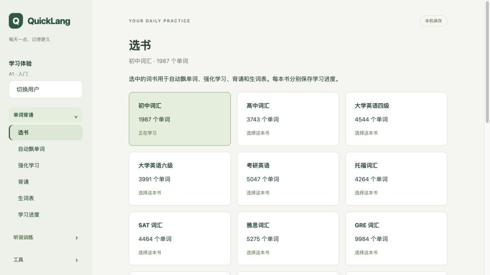
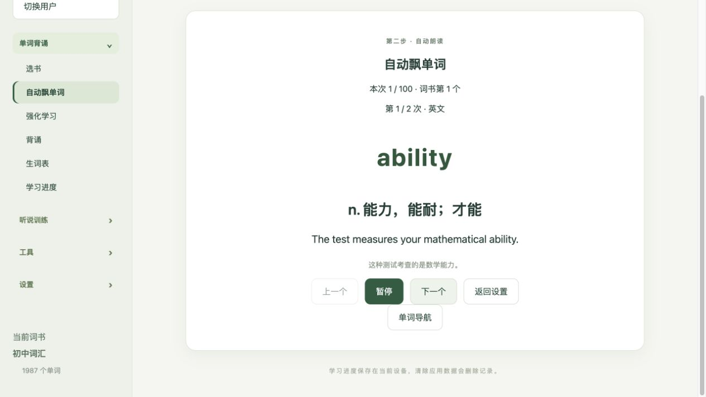
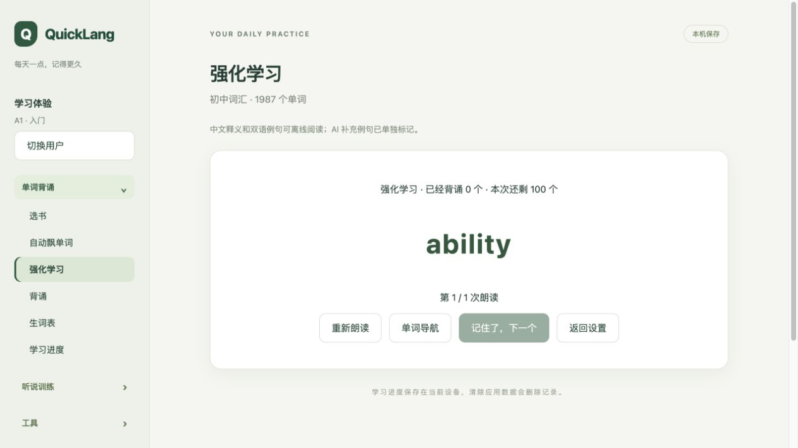
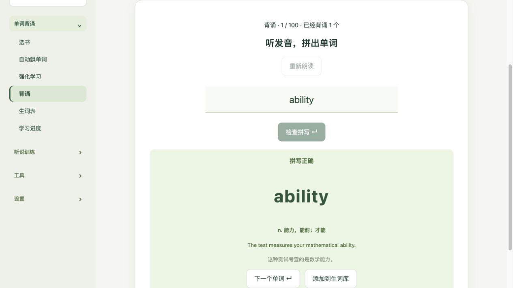
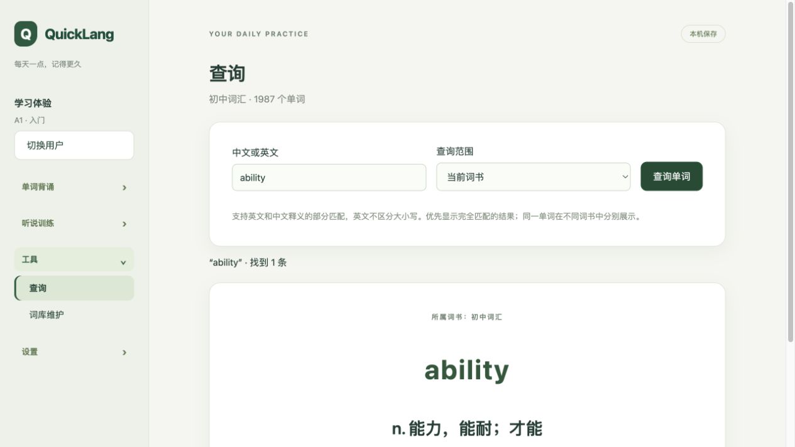

# QuickLang

一款面向个人的英语学习应用，围绕单词背诵、听说训练和 AI 陪练，帮助你持续练习英语。

## 第一章：背景

因为自家孩子学英语总是磨洋工, 而且背单词效率非常低下, 故将我自己的学单词的方法, 沉淀到软件中, 帮助小朋友更快的背单词.

## 第二章：功能

从选词书、记单词到听说练习，下面用 6 张实际截图展示主要功能（本地浏览器预览，点击图片可查看原图）。

| 选书：按学习目标选择词书                                                                        | 自动飘单词：边听边记单词和例句                                                                                                |
| ----------------------------------------------------------------------------------------------- | ----------------------------------------------------------------------------------------------------------------------------- |
| [](docs/images/quicklang-01-books.png) | [](docs/images/quicklang-02-auto-recite.png) |

| 强化学习：听发音，停顿回忆                                                                                        | 拼写背诵：输入单词，即时检查                                                                                        |
| ----------------------------------------------------------------------------------------------------------------- | ------------------------------------------------------------------------------------------------------------------- |
| [](docs/images/quicklang-03-flashcard.png) | [](docs/images/quicklang-04-spelling.png) |

| 听说练习：结合双语字幕练听写                                                                                                      | 单词查询：随时查释义和例句                                                                                    |
| --------------------------------------------------------------------------------------------------------------------------------- | ------------------------------------------------------------------------------------------------------------- |
| [](docs/images/quicklang-05-conversation.png) | [](docs/images/quicklang-06-search.png) |

左侧菜单分为五组，二级菜单及功能如下。

### 单词背诵

| 二级菜单   | 功能介绍                                             |
| ---------- | ---------------------------------------------------- |
| 选书       | 选择内置词书，各词书分别保存学习进度。               |
| 自动飘单词 | 按设定的单词数量、朗读次数和间隔自动展示并朗读单词。 |
| 强化学习   | 通过朗读、停顿回忆和释义卡片强化单词记忆。           |
| 背诵       | 通过拼写练习检验记忆，并将拼错的单词自动加入生词表。 |
| 生词表     | 集中查看、收藏和移除当前词书中需要重点学习的单词。   |
| 学习进度   | 按词书查看强化学习、背诵进度和生词数量，并继续学习。 |

### 听说训练

| 二级菜单 | 功能介绍                                                            |
| -------- | ------------------------------------------------------------------- |
| 听说练习 | 围绕练习材料完成听写、理解题、录音跟读和脱稿表达。                  |
| 听力训练 | 导入本地音频及 SRT/VTT 字幕，进行精听、跟读、盲听、复述和间隔复习。 |
| AI 陪练  | 用文字或录音回答场景问题，获取 AI 表达反馈并继续回答追问。          |

### 同声翻译

- **启动**：Mac 与 iOS 统一使用本地英文实时字幕，可随时开启或关闭双语字幕，并选择目标语言和翻译模型。分段录音翻译设置默认收起，两端均支持先转写再翻译或直接音频翻译；旧云端采集模式已移除。
- **历史记录**：回放、导出原始音频，重试缺失转写，运行独立的全文翻译与摘要分析。历史和分段数据保存在本机专用会话/分段表中（Mac 默认 seekdb，iOS 使用 SQLite），与听力材料库分表存储。

同声翻译使用原生采集和系统权限，不支持浏览器替代采集。Apple 本地实时英文识别保持独立；MP3 录音按停顿形成约 5–15 秒批次，有远程语音模型时优先转写，否则使用 Apple 本地转写，再携带最近 30–60 秒文字上下文交给文本模型翻译。每累计约 30–40 秒会统一校正最近译文。历史中同时保留实时识别/实时翻译文字和后台校正字幕，并提供双语润色、1000–2000 字总结及单段深度翻译。iOS 在页面显示字幕，Mac 使用原生浮层。详见[模块说明](docs/architecture/modules.md#interpretation)。

### 工具

| 二级菜单 | 功能介绍                               |
| -------- | -------------------------------------- |
| 查询     | 在词书中检索单词，查看释义和例句。     |
| 词库维护 | 创建词书并维护其中的单词、释义和例句。 |

### 设置

| 二级菜单 | 功能介绍                                                     |
| -------- | ------------------------------------------------------------ |
| 用户设置 | 创建或切换本机用户，设置名称和英语水平，并分别保存学习记录。 |
| 系统设置 | 配置 AI 服务地址、对话模型、语音转写模型和 API Key。         |

内置 14 本词书，初中、高中、四级、六级和考研按阶段提供完整版，四级、六级和考研另有纯版；全部附有中文释义和双语例句，可离线阅读。AI 补充例句在界面中单独标记。AI 反馈和转写需要网络及相应服务配置，基础单词学习无需配置 AI。

当前项目仍在开发中，学习记录保存在当前设备，尚未提供跨设备同步；浏览器可预览界面，但听力训练的音频和进度持久化需要桌面版。更多说明见[听力训练文档](docs/development/0.1/listening.md)。

## 第三章：快速上手

### 普通用户：下载发布包

1. 打开 [GitHub Releases](https://github.com/longdafeng/quicklang/releases)，在目标版本的 **Assets** 中下载 `QuickLang-<version>-macos-arm64.zip`。
2. 解压后，将 `QuickLang.app` 拖入“应用程序”文件夹，双击启动。
3. 首次启动会初始化本机数据库并加载内置词库，随后创建用户、选择英语水平和词书，即可开始学习。
4. 如需 AI 陪练或语音转写，在“设置 → 系统设置”中填写相应服务配置。

> 当前发布包面向 **macOS 15 及以上的 Apple Silicon（M 系列芯片）Mac**，无需安装 Node.js、Rust、Homebrew 或数据库。

[直接下载 QuickLang 0.1.0 ZIP](https://github.com/longdafeng/quicklang/releases/download/v0.1.0/QuickLang-0.1.0-macos-arm64.zip)。用户只需下载这一个 ZIP，校验文件可按需下载。

维护者执行 `make release`，将 `dist/releases/` 中生成的带版本号 ZIP 和 `.sha256` 校验文件上传到对应 GitHub Release。

当前打包流程尚未配置 Apple Developer ID 签名和公证；若 macOS 阻止打开，请确认下载来源可信后，在“系统设置 → 隐私与安全性”中允许打开。

### 开发者：从源码运行

项目使用 **Tauri 2 + React / TypeScript + Rust + seekdb**。

#### 1. 准备环境

- macOS 15 及以上，Apple Silicon 芯片。
- Node.js 22.12 及以上。
- Apple Command Line Tools，可执行 `xcode-select --install` 安装。
- CMake；如果已安装 Homebrew，初始化脚本会在缺少 CMake 时自动安装，否则需自行准备。

初始化脚本会按项目锁定版本准备本地 Rust 工具链和 npm，下载、校验并构建 seekdb 原生依赖，无需预先安装 Rust 或数据库。

#### 2. 获取源码并初始化

```sh
git clone https://github.com/longdafeng/quicklang.git
cd quicklang
make init
```

首次初始化需要联网下载依赖并编译原生组件，同时创建数据库和导入内置词库；重复执行会补齐缺失内容并保留已有数据和用户编辑。浏览器与桌面直接使用 `src/ui/public/content/word-library/` 中已经生成并提交的最终数据（17,844 个单词、14 本词书、60,897 个有序成员）；初始化、构建和开发启动均不生成词书，也不依赖上游仓库。完整流程与故障处理见[初始化脚本说明](scripts/README.md)。

#### 3. 启动开发环境

使用 `make dev` 启动带热更新的 Tauri 桌面开发环境。需要构建并运行独立应用时，执行 `make build`，再打开 `dist/darwin-arm64/macos/QuickLang.app`。

仅开发或预览前端界面时，可以启动浏览器预览：

```sh
npm run dev
```

默认访问地址为 <http://127.0.0.1:1420>；浏览器预览不具备完整的桌面原生能力。

#### 4. 测试与打包

格式化工具随 npm 开发依赖安装并锁定版本，Rust 使用项目工具链中的 rustfmt。`make format` 与 `make format-check` 使用同一套规则，覆盖 `src/`、`scripts/`、`tests/` 中的源码（包含新增未提交文件），排除第三方依赖、生成目录、静态资源与词库数据。JSON/TOML 等配置文件和 Markdown 文档不属于源码格式检查范围。检查失败后运行 `make format` 修复即可。

| 命令                | 用途                                                                                                                                                                                                            |
| ------------------- | --------------------------------------------------------------------------------------------------------------------------------------------------------------------------------------------------------------- |
| `make format`       | 格式化全部项目源码（Rust、JS/TS/TSX、CSS/HTML、Objective-C、Shell、SQL）。                                                                                                                                      |
| `make format-check` | 只检查源码格式，不修改文件；不符合规范时返回非零退出码。                                                                                                                                                        |
| `make test`         | 先检查全部源码格式，再运行不依赖数据库的本地测试；格式不符合要求立即报错。                                                                                                                                      |
| `make test-ai`      | 从根目录 `.env.test` 读取测试服务：HTTP 客户端探测文本模型，桌面原生统一转写网关使用固定 MP3 验证文本与语音模型；不会读取 seekdb。                                                                              |
| `make test-db`      | 运行真实数据库的持久化、并发和回滚测试。                                                                                                                                                                        |
| `make review`       | 运行 Rust clippy、类型检查和代码边界检查。                                                                                                                                                                      |
| `make docs`         | 启动本地文档站（默认 http://127.0.0.1:5173），修改后自动刷新，Ctrl+C 停止。                                                                                                                                     |
| `make docs-build`   | 构建静态文档站，输出到 `build/docs/site/`。                                                                                                                                                                     |
| `make build`        | 构建前端，使用 debug 模式构建服务和桌面应用；Rust 产物位于 `build/macos/cargo/debug/`，应用复制到 `dist/<platform>-<arch>/`。                                                                                   |
| `make clean`        | 统一清理 Mac/iOS/Web 的 `build/`、`dist/`、`target/`、Tauri 生成文件及当前项目的 Xcode DerivedData、原生驱动构建目录、前端缓存与增量文件；每个目录显示进度，耗时删除每 5 秒提示。保留依赖、工具链和用户数据库。 |
| `make release`      | 使用 release 模式构建服务和桌面应用（`build/macos/cargo/release/`），校验并生成 macOS ARM64 发布 ZIP 及 SHA-256 文件，输出到 `dist/releases/`。                                                                 |
| `make install`      | 先执行完整的 `make release` 流程，成功后将 release 应用安装到当前用户的 Applications 目录，目标存在时拒绝覆盖。                                                                                                 |

真实模型测试先执行 `cp .env.test.example .env.test`，再填写测试专用的 Base URL、API
Key、文本模型和语音转写模型。`.env.test` 已被 Git 忽略；测试不会读取个人 seekdb，也不会输出
API Key 或服务端错误正文。配置完成后运行 `make test-ai`。即使 HTTP 或桌面原生检查之一失败，
另一组检查仍会继续执行；macOS 原生检查覆盖应用实际使用的 PAC/SOCKS 网络链路及统一语音协议路由。
语音测试读取 `tests/fixtures/ai/nice-to-meet-you-my-name-is-longda.mp3`，并要求转写结果为完整的
“Nice to meet you, my name is Longda”。需要重新生成该固定音频时，在 macOS 安装 ffmpeg 后运行
`npm run generate:test-audio`；日常测试直接使用仓库中已提交的 MP3，不依赖系统语音或 ffmpeg。

默认数据库目录为 `~/Library/Application Support/io.github.longdafeng.quicklang/seekdb-1.4.0/`。开发时可用 `QUICKLANG_DATA_DIR=/absolute/path make init` 指定独立数据库，并在 `make dev` 时使用相同变量；初始化前请退出占用该数据库的应用。

前端位于 `src/ui/`：`src/ui/src/desktop/` 和 `src/ui/src/ios/` 分别拥有平台外壳、导航和同传视图，`src/ui/src/shared/` 复用启动、用户、学习业务、历史记录与原生通信。入口 `src/ui/src/app/App.tsx` 选择平台；公共层不导入平台目录，两端不互相依赖。Tauri 共用宿主位于 `src/app/`（macOS 与 iOS 共用，crate 为 `quicklang-app`），共享 Rust 领域/用例/适配器位于 `src/crates/`；`src/server/` 是独立 HTTP 服务骨架，不参与桌面 AI 请求，也尚未提供跨设备同步。当前学习页面仍主要使用前端进度，尚未接入已实现的 Rust 复习事务链路。完整说明见[产品与技术架构](docs/quicklang-product-technical-design-v1.md)和[文档首页](docs/index.md)。

测试位于 `tests/`，原始开发文档与资源位于 `docs/`。文档工具配置位于 `scripts/docs/`，缓存、临时产物和网站输出统一位于 `build/docs/`；侧边栏自动保留文档目录层次，无需手工登记页面。进一步阅读：[实现说明](docs/development/0.1/implementation.md)、[词库数据库说明](docs/development/0.1/word-library-schema.md)、[原生依赖说明](deps/seekdb/README.md)。

QuickLang 自有代码采用 Apache-2.0 许可证；Ink-Learner 词库单独遵循 CC BY-SA 4.0，详见[词库署名说明](src/ui/public/content/word-library/ATTRIBUTION.md)。

## 第四章：未来 Milestone

以下为后续版本规划。

| 版本    | 计划                                                                      |
| ------- | ------------------------------------------------------------------------- |
| **1.0** | 发布 Mac 桌面版，完善所有单词学习功能。                                   |
| **2.0** | 发布 Mac 桌面版升级版本，完善所有听说训练功能，支持辅助参加英文视频会议。 |
| **3.0** | 发布苹果手机 iPhone（iOS）版本，让应用可以在手机上运行。                  |
| **4.0** | 发布苹果 iPad（iPadOS）版本，让应用可以在 iPad 上运行。                   |

## iPhone 17 / iOS 开发

iOS 版本使用 SQLite 保存本机学习记录，macOS 继续使用 seekdb。完整 Xcode 环境下可运行
`make ios-init`、`make ios-simulator`、`make ios-dev`；真机签名通过自己的
`APPLE_DEVELOPMENT_TEAM` 配置。详细前置条件、构建与安装步骤见 [iOS 开发指南](scripts/ios-README.md)。
iOS 27 版已接入系统授权的屏幕音频采集、麦克风和设备端英文识别，字幕在应用页面内显示；系统音频需在系统选择器授权整个屏幕，受保护内容可能无法采集。未提供 Mac 式跨应用悬浮字幕，也未实现 Mac 数据迁移或跨设备同步。真机验收状态见 [验证记录](docs/development/0.2/ios-sqlite-validation.md)。

### 桌面与 iPhone 构建入口

桌面版使用 `make build`、`make release`、`make install`。iPhone 使用
`make build_ios`、`make release_ios`、`make install_ios`（也支持连字符写法）。
安装命令自动检测唯一连接的 iPhone/iPad 和已有签名团队，完成构建、安装与启动；
多个候选时用 `IOS_DEVICE` 和 `APPLE_DEVELOPMENT_TEAM` 明确选择。单独真机构建仍需
`APPLE_DEVELOPMENT_TEAM`。无签名模拟器构建使用
`IOS_TARGET=simulator make build-ios`。签名和设备配置见
[iPhone 构建说明](scripts/ios-README.md)。两端回归验证使用 `make test-apple`。
Mac 与 iOS 构建输出分别位于 `build/macos/`、`build/ios/`，支持跨平台并行构建；
普通前端构建使用 `build/web/`。同一平台的打包任务仍应串行运行。
