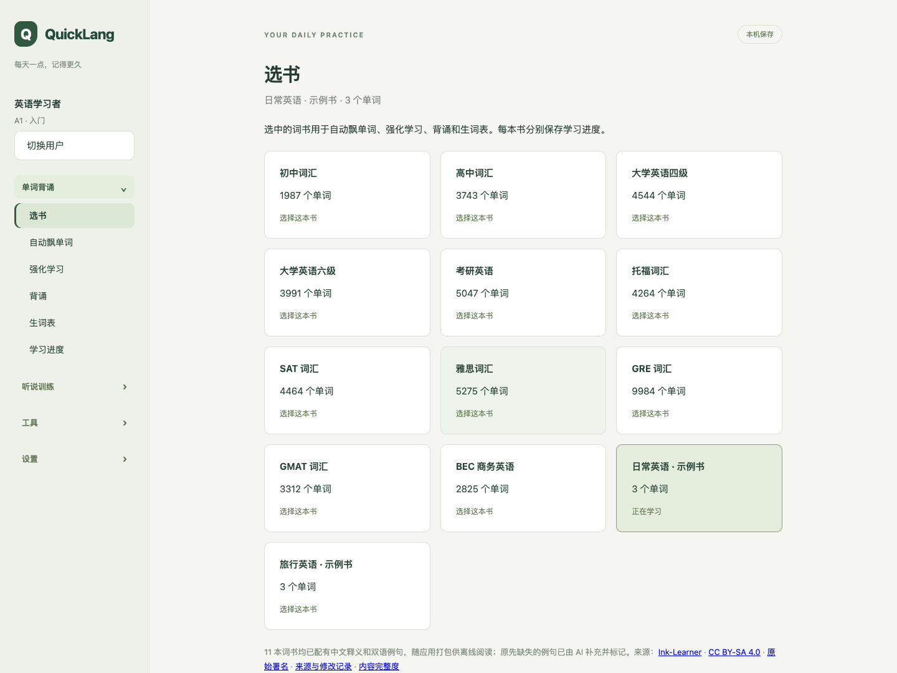

# QuickLang

一款面向个人的英语学习应用，围绕单词背诵、听说训练和 AI 陪练，帮助你持续练习英语。

## 第一章：背景

因为自家孩子学英语总是磨洋工, 而且背单词效率非常低下, 故将我自己的学单词的方法, 沉淀到软件中, 帮助小朋友更快的背单词. 

## 第二章：功能

下面是当前界面的实际截图（本地浏览器预览）：



左侧菜单分为四组，二级菜单及功能如下。

### 单词背诵

| 二级菜单 | 功能介绍 |
| --- | --- |
| 选书 | 选择内置词书，各词书分别保存学习进度。 |
| 自动飘单词 | 按设定的单词数量、朗读次数和间隔自动展示并朗读单词。 |
| 强化学习 | 通过朗读、停顿回忆和释义卡片强化单词记忆。 |
| 背诵 | 通过拼写练习检验记忆，并将拼错的单词自动加入生词表。 |
| 生词表 | 集中查看、收藏和移除当前词书中需要重点学习的单词。 |
| 学习进度 | 按词书查看强化学习、背诵进度和生词数量，并继续学习。 |

### 听说训练

| 二级菜单 | 功能介绍 |
| --- | --- |
| 听说练习 | 围绕练习材料完成听写、理解题、录音跟读和脱稿表达。 |
| 听力训练 | 导入本地音频及 SRT/VTT 字幕，进行精听、跟读、盲听、复述和间隔复习。 |
| AI 陪练 | 用文字或录音回答场景问题，获取 AI 表达反馈并继续回答追问。 |

### 工具

| 二级菜单 | 功能介绍 |
| --- | --- |
| 查询 | 在词书中检索单词，查看释义和例句。 |
| 词库维护 | 创建词书并维护其中的单词、释义和例句。 |

### 设置

| 二级菜单 | 功能介绍 |
| --- | --- |
| 用户设置 | 创建或切换本机用户，设置名称和英语水平，并分别保存学习记录。 |
| 系统设置 | 配置 AI 服务地址、对话模型、语音转写模型和 API Key。 |

内置 11 本 词书，附有中文释义和双语例句，可离线阅读；AI 补充例句在界面中单独标记。AI 反馈和转写需要网络及相应服务配置，基础单词学习无需配置 AI。

当前项目仍在开发中，学习记录保存在当前设备，尚未提供跨设备同步；浏览器可预览界面，但听力训练的音频和进度持久化需要桌面版。更多说明见[听力训练文档](docs/development/listening.md)。

## 第三章：快速上手

### 普通用户：下载发布包

1. 打开 [GitHub Releases](https://github.com/longdafeng/quicklang/releases)，在目标版本的 **Assets** 中下载 `QuickLang-<version>-macos-arm64.zip`。
2. 解压后，将 `QuickLang.app` 拖入“应用程序”文件夹，双击启动。
3. 首次启动会初始化本机数据库并加载内置词库，随后创建用户、选择英语水平和词书，即可开始学习。
4. 如需 AI 陪练或语音转写，在“设置 → 系统设置”中填写相应服务配置。

> 当前发布包面向 **macOS 15 及以上的 Apple Silicon（M 系列芯片）Mac**，无需安装 Node.js、Rust、Homebrew 或数据库。仓库目前尚未上传 Release；发布后即可按上述步骤下载使用。

当前打包流程尚未配置 Apple Developer ID 签名和公证；若 macOS 阻止打开，请确认下载来源可信后，在“系统设置 → 隐私与安全性”中允许打开。

### 开发者：从源码运行

项目使用 **Tauri 2 + React / TypeScript + Rust + seekdb**。

#### 1. 准备环境

- macOS 15 及以上，Apple Silicon 芯片。
- Node.js 22.12 及以上。
- Apple Command Line Tools，可执行 `xcode-select --install` 安装。
- CMake；如果已安装 Homebrew，初始化脚本会在缺少 CMake 时自动安装，否则需自行准备。

初始化脚本会按项目锁定版本准备本地 Rust 工具链和 npm，下载、校验并构建 seekdb 原生依赖，无需预先安装 Rust 或数据库。

#### 2. 获取源码并初始化

```sh
git clone https://github.com/longdafeng/quicklang.git
cd quicklang
make init
```

首次初始化需要联网下载依赖并编译原生组件，同时创建数据库和导入内置词库；重复执行会补齐缺失内容并保留已有数据。完整流程与故障处理见[初始化脚本说明](scripts/README.md)。

#### 3. 启动开发环境

```sh
# 启动 macOS 桌面应用
make build
```
```
cd build/cargo/release/bundle/macos/
open QuickLang.app
```


仅开发或预览前端界面时，可以启动浏览器预览：

```sh
npm run dev
```

默认访问地址为 <http://127.0.0.1:1420>；浏览器预览不具备完整的桌面原生能力。

#### 4. 测试与打包

| 命令 | 用途 |
| --- | --- |
| `make test` | 运行不依赖数据库的本地测试。 |
| `make test-db` | 运行真实数据库的持久化、并发和回滚测试。 |
| `make review` | 运行 Rust clippy、类型检查和代码边界检查。 |
| `make docs` | 构建文档站。 |
| `make build` | 构建前端、服务和桌面应用，输出到 `dist/<platform>-<arch>/`。 |
| `make release` | 重新构建并生成 macOS ARM64 发布 ZIP 及 SHA-256 校验文件，输出到 `dist/releases/`。 |
| `make install` | 将构建的应用安装到当前用户的 Applications 目录，目标存在时拒绝覆盖。 |

默认数据库目录为 `~/Library/Application Support/io.github.longdafeng.quicklang/seekdb-1.4.0/`。开发时可用 `QUICKLANG_DATA_DIR=/absolute/path make init` 指定独立数据库，并在 `make dev` 时使用相同变量；初始化前请退出占用该数据库的应用。

源码位于 `src/`，测试位于 `tests/`，开发文档位于 `docs/`。进一步阅读：[实现说明](docs/development/implementation.md)、[词库数据库说明](docs/development/word-library-schema.md)、[原生依赖说明](deps/seekdb/README.md)。

QuickLang 自有代码采用 Apache-2.0 许可证；Ink-Learner 词库单独遵循 CC BY-SA 4.0，详见[词库署名说明](src/ui/public/content/ink/ATTRIBUTION.md)。

## 第四章：未来 Milestone

以下为后续版本规划。

| 版本 | 计划 |
| --- | --- |
| **1.0** | 发布 Mac 桌面版，完善所有单词学习功能。 |
| **2.0** | 发布 Mac 桌面版升级版本，完善所有听说训练功能，支持辅助参加英文视频会议。 |
| **3.0** | 发布苹果手机 iPhone（iOS）版本，让应用可以在手机上运行。 |
| **4.0** | 发布苹果 iPad（iPadOS）版本，让应用可以在 iPad 上运行。 |
