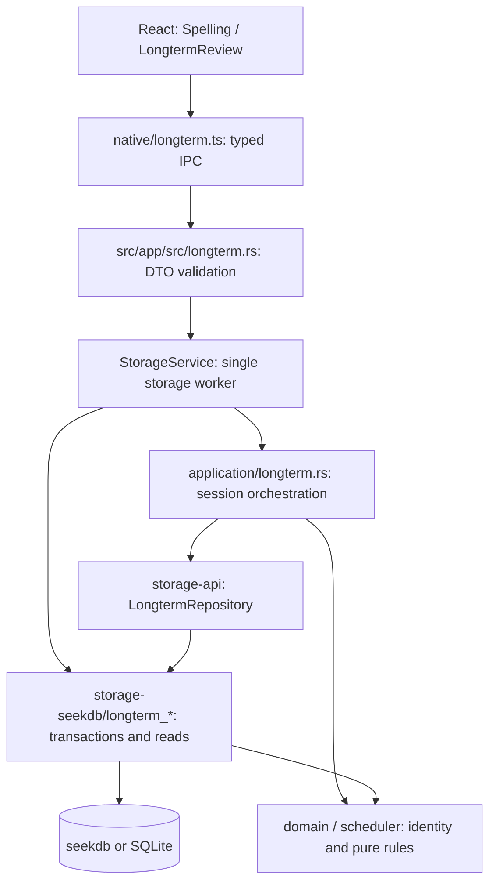
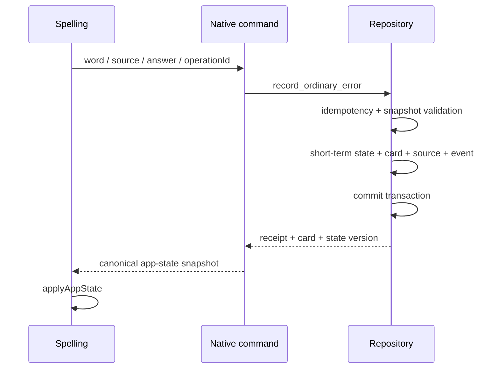
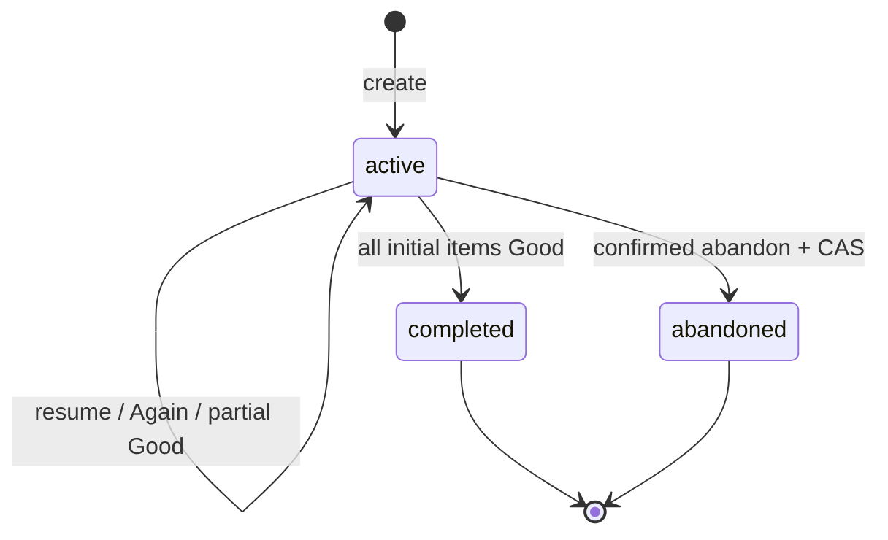

# 当前分支长期学习功能与实现逻辑详解

生成日期：2026-10-05。分析对象：`issue/45-longterm-learning-opencode`。

## 1. 分析范围与整体功能

本分支的核心是 QuickLang 0.7 长期学习：把普通背诵中的错误变成可持续复习的卡片，再通过固定间隔调度、正式复习会话、提前练习和事件统计形成学习闭环。实现跨越 React UI、Tauri IPC、Rust application/domain/scheduler、Repository 与 seekdb/SQLite 两种存储后端。

但目前不能把它描述成所有入口均已完成的发布版本：清除与来源生命周期主要停留在 Repository，手动添加和导出已注册 IPC，但前端尚无相应操作入口；发布开关没有接入命令调用点；大规模错误次数排序存在性能缺口，真机验收也未完成。

### 1.1 分析快照与范围

- 分支：`issue/45-longterm-learning-opencode`。
- HEAD：`286631a66d0abf037ced2b176e90e7e83c5fc753`。
- 以分叉点为基线，本分支新增 43 个提交，涉及 91 个文件，新增 60,754 行、删除 75 行。
- 按用户要求，忽略 main 分叉后的 4 个提交；本文不比较或展开它们。
- 重点依据当前源码解释功能、模块职责、调用链、事务与状态变化，不将设计意图直接视为实现完成。

当前另有 4 个未提交文件：`scripts/ios-device.mjs`、`scripts/ios.mjs` 及各自单测，共新增 114 行、删除 5 行。主体分析已提交长期学习功能，第 13 节另列工作区变化；没有修改这些既有改动。

## 2. 从用户视角看新增功能

| 功能                 | 行为                                                    | 实际接入程度                                           |
| -------------------- | ------------------------------------------------------- | ------------------------------------------------------ |
| 普通背诵错误自动入库 | 答错时关联词书来源、创建或更新长期卡、重置复习时间      | UI → IPC → Repository 已接通                           |
| 今日复习首页         | 展示到期数量、已掌握数量、7 日首次正确率、30 日错误次数 | UI 已接通                                              |
| 正式复习             | 自动选取到期卡，听音拼写，根据 Good/Again 更新长期计划  | UI 已接通                                              |
| 恢复与放弃会话       | 继续未完成会话；确认后放弃，不回滚已提交作答            | UI 已接通                                              |
| 提前练习             | 从错题列表选 1–100 张卡，不改变长期调度                 | UI 已接通                                              |
| 错题列表             | 四种筛选、三种排序、游标分页、跨页选择                  | 已用于提前练习选择页                                   |
| 卡片详情             | 卡片、来源、近期事件等查询                              | IPC 已接通；会话内部使用来源解析，未见独立详情页面     |
| 手动添加             | 添加新卡或补充来源，不重置已有卡计划                    | Repository 与 IPC 已有，未见前端手动添加入口           |
| 来源生命周期         | 暂停、恢复、解绑来源与显示来源回退                      | Repository 已有；未注册对应 IPC                        |
| 三种清除             | 按词、词书、用户清除，擦除敏感字段并写墓碑              | Repository 已有；未注册清除 IPC，未见用户操作入口      |
| JSON 导出            | 一致快照、分批输出、可排除原始答案                      | Repository 与 IPC 已有；未见前端导出按钮与文件交付流程 |
| 发布开关             | 写入、入口、导出三个 owner 级开关                       | 存储载体已实现，入口尚未接线                           |

“已接通”描述源码调用关系；UI mock 测试通过不代表实体设备上的完整体验已验收。

## 3. 架构与模块职责



| 层           | 主要文件                                           | 责任                                              |
| ------------ | -------------------------------------------------- | ------------------------------------------------- |
| 展示与交互   | `src/ui/src/shared/features/longterm/`             | 首页、答题、等待、提前练习选择、错误提示          |
| 普通背诵接入 | `src/ui/src/shared/features/spelling/Spelling.tsx` | 答错切换为原子原生命令，应用返回快照              |
| 类型桥接     | `src/ui/src/shared/native/longterm.ts`             | camelCase DTO、命令名、错误码与边界校验           |
| IPC          | `src/app/src/longterm.rs`                          | DTO 校验、工作线程调度、应用层调用、响应组装      |
| 连接所有权   | `src/app/src/storage.rs`                           | 原生连接留在单一 worker，以 typed reply 返回结果  |
| 应用编排     | `src/crates/application/src/longterm.rs`           | 建立/恢复会话、提交、放弃、时钟与评分约束         |
| 领域         | `src/crates/domain/src/longterm.rs`                | 身份规范化、ID/hash、generation、状态、稳定错误码 |
| 调度         | `src/crates/scheduler/src/longterm.rs`             | 固定阶梯、逾期分层、稳定随机、候选过滤            |
| 契约         | `src/crates/storage-api/src/longterm.rs`           | 六类记录、命令、结果、Repository/Storage trait    |
| 持久化       | `src/crates/storage-seekdb/src/longterm*.rs`       | SQL、幂等、CAS、事务、清除、指标、导出            |

主要依赖方向为 UI → IPC → application/Repository → storage。application 不依赖 SQL 或 SQLite/seekdb 原生类型。

需要注意两点：普通背诵错误 handler 当前直接调用 Repository，没有统一经过 application 薄层；存储 `longterm_repo.rs` 仍存在 `sr_next_good`、`sr_next_again` 等调度实现，不能宣称所有规则只有 scheduler 一份实现。两处实现保持一致依赖测试约束，后续维护应注意规则漂移。

源码定位：`StorageService::longterm` 位于 `src/app/src/storage.rs:384` 附近；会话编排见 `src/crates/application/src/longterm.rs:155` 起；真实作答事务见 `src/crates/storage-seekdb/src/longterm_repo.rs:1128`。

## 4. 数据模型：为什么需要六张表

| 表                         | 保存内容                                                       | 解决的问题                 |
| -------------------------- | -------------------------------------------------------------- | -------------------------- |
| `ql_longterm_card`         | 用户与词形身份、generation、间隔、到期时间、掌握标记、版本     | 一个长期复习对象的当前状态 |
| `ql_longterm_source`       | 卡片关联的词书/条目或手动来源、生命周期、最近错误时间          | 同词多来源与来源失效       |
| `ql_longterm_event`        | operation/event ID、payload hash、评分、原始答案、计划前后快照 | 幂等、审计、统计、回溯     |
| `ql_longterm_session`      | 正式/提前类型、冻结数量、完成数量、会话状态、版本              | 可恢复的一组复习任务       |
| `ql_longterm_session_item` | 卡片 generation、初始顺序、队列顺序、等待截止、次数、版本      | 会话内排队与作答 CAS       |
| `ql_longterm_tombstone`    | owner hash、清除范围、已清 generation、清除时间                | 阻止清除前的旧操作复活数据 |

SQL 定义在 `src/schema/ql_longterm_*.sql`，SQLite 对应定义在 `src/crates/storage-seekdb/src/sqlite_schema.sql`。卡片主键为 `(card_id, generation)`；会话内 `(session_id, card_id, generation)` 唯一。

### 4.1 同一个词如何归并

规范化顺序固定为：去除首尾 Unicode 空白 → NFKC → 与 locale 无关的 Unicode lowercase。内部空白保留。算法版本是 `nfkc-lower-v1`。

card ID 使用带域分隔的 SHA-256，输入含 `user_id`、练习类型 `listening-to-spelling`、身份版本与规范化词形。词书 ID 不进入 card ID。

因此同一用户在不同词书遇到同一规范化词形，共享一张长期卡并保留多个来源；不同用户不共享卡；这也不是按词义或翻译做语义归并。实现见 `src/crates/domain/src/longterm.rs:47`、`:60`。

### 4.2 generation 与来源不是同一个概念

初次出现 generation 为 1。清除后重新遇到该词时，新 generation 为已有 generation 与墓碑 cleared generation 的最大值加 1。新一代可继续学习，但旧 generation 的事件不能重写新数据。

card 状态：active / paused / erased。source 状态：active / paused / deleted / erased。卡片历史可以在没有有效来源时保留；但正式复习要求存在 active 来源。来源失效与隐私清除有不同含义。

## 5. 普通背诵错题：从多个更新变成一笔事务

旧路径由 UI 保存短期 session/activity，再通过错误回调处理错词。新路径保留答对时的短期保存行为，答错则调用 `recordOrdinaryError`。



事务同时覆盖普通背诵进度、学习活动、生词本、长期卡、来源与事件。某一步失败则全部回滚，UI 留在当前问题并显示保存失败；不会出现“已经跳到下一题，但长期错题没有写入”的半提交状态。

UI 用 `pendingError` 保留同一道题、同一轮次、同一答案的 operation ID 与客户端时间。重试发送同一请求；改变答案或问题才建立新操作。native 成功后通过 `applyAppState` 应用服务端快照，不在 UI 再独立重算长期进度。

普通错误会把长期计划重置到 step=0、间隔 1 天、到期时间为有效错误时刻加 24 小时。已有 `mastered_at` 保留，因此“曾达到掌握阈值”不等于以后永不遗忘。

实现定位：`Spelling.tsx:180` 起、`src/app/src/longterm.rs:683`、`longterm_ordinary.rs:339`。错误路径活动日期键使用 UTC 日期函数 `utc_date_key`，答对路径仍调用前端 `localDateKey`；它们并非天然完全相同的时区口径，后续跨日行为需特别核对。

## 6. 复习调度：固定阶梯与正式选卡

### 6.1 Good/Again

只有“拼写正确、未使用提示、未揭示答案、未跳过”才判 Good，其他组合为 Again。后端应用层再次检查评分信号，不能只信任前端传来的 Good 字符串。

| 作答       | 对长期计划的影响                                         | 会话内行为               |
| ---------- | -------------------------------------------------------- | ------------------------ |
| 正式 Good  | 间隔推进：1 → 3 → 7 → 14 → 30 → 60 → 120…，上限 3,650 天 | 该条目完成，不再次结算   |
| 正式 Again | step 归 0，interval=1 天，due=错误时刻+24h               | 移到队尾，至少等待 60 秒 |
| 提前 Good  | 不改变长期计划                                           | 该练习条目完成           |
| 提前 Again | 不改变长期计划，也不写长期 last_error_at/lapse           | 移到队尾，至少等待 60 秒 |

首次达到至少 30 天间隔时记录 `mastered_at`；掌握不是终态。再次答错也不会抹掉曾经掌握的标记。

同一正式会话内，同一条目的第一次 Again 增加一次 `lapse_count`，后续 Again 不重复增加。它与统计中的“首次作答是否 Again”是不同口径：先 Good 的条目会直接结束；统计聚焦每会话每卡的第一个正式事件。

scheduler 是可注入时间的纯函数，没有直接取系统当前时间；实际服务用本地业务时钟。这里的“服务端时间”指本地原生服务，不代表云服务器或经过网络校准的时钟。

源码：`scheduler/longterm.rs:24`、`:115`、`:133`、`:167`、`:401`；评分 `application/longterm.rs:124` 附近；存储提交 `longterm_repo.rs:1128`。

### 6.2 哪些卡会进入正式会话

候选必须满足 owner 隔离、active 卡、至少一个 active 来源、未被墓碑覆盖、到期时间不晚于选择时刻、未占用另一 active 正式会话。

默认组大小 20，可配置范围 5–100；这是请求大小范围，不意味着可见卡不足 5 张时必须凑足。到期卡按逾期层优先：≥30 天、7–29 天、1–6 天、不足 1 天。层内顺序由 session ID、card ID、generation 的 SHA-256 确定，重启恢复不会重新随机。

初始选卡与会话/条目创建在 Repository 事务内完成。创建后集合冻结，不因为又有新卡到期就追加进当前会话。

“今日到期”实际上是当前时刻已到期的可见卡数量，不是截至今天 23:59 的预测数量。日历显示时区不能改写 UTC 毫秒到期条件。

## 7. 会话状态机、恢复与作答交互



每用户每种 kind 最多一个 active 会话，正式与提前各自独立。创建时发现已有会话就恢复它；并发创建遇到 SESSION_EXISTS 时也尝试读取获胜者的会话。

条目状态路径为 ready → Again → waiting → 到时间可答 → Good。等待期间允许处理其他可用条目；如果只剩等待条目，UI 展示截止时间/倒计时。等待期限由原生服务计算，前端时间仅用于展示与避免无效提交。

恢复是读取已保存 session/item，不重选、不重排、不清除等待。用户返回首页不等于 abandon；明确放弃需要二次确认和会话版本。已经提交的历史事件与调度结果不会因放弃而撤销。

`useReviewSession` 用写入锁避免双击并发提交，保留 pending 请求支持幂等重试，提交后重新读取 backend 当前条目并刷新首页指标。列表读取使用 ticket 丢弃旧响应，避免晚到结果覆盖新筛选。

听音拼写使用既有 `speak` 能力；提示、揭示、跳过影响评分。播放技术失败不应自动写成错误，前端允许重试播放并显示技术失败提示。可视反馈已有测试，但 TTS 真实设备回退及“如何确认已经听到”的产品语义仍有遗留，不能把 mock 覆盖当真机结论。

主要组件：`LongtermReview.tsx:20`、`ReviewSession.tsx:49`、`useReviewSession.ts:179` 附近、`EarlyPractice.tsx:61`。

## 8. 错题本、手动添加与统计

### 8.1 错题列表与分页

筛选有 all / due / mastered / paused；paused 同时包含没有 active 来源的卡。排序有最近错误时间、到期时间、累计错误次数。每种排序最终由 card ID 与 generation 打破并列。

分页是 keyset cursor，没有采用越翻越慢的 OFFSET。cursor 带版本、owner hash、筛选、排序、位置和摘要校验；换用户、换筛选/排序、格式损坏返回 `LONGTERM_CURSOR_INVALID`，UI 重置第一页。摘要校验用于完整性检测，不应把可公开计算的摘要描述为带密钥鉴权。

列表错误次数是该 card/generation 的普通错误事件数加 `lapse_count`，没有时间窗口；它不是首页 30 日错误次数。该排序键目前实时聚合，没有存储成卡片列，这也造成容量测试中的性能瓶颈。

提前练习页可以跨页选择，显式传入 `(card_id, generation)`；不能只传词形或用前端猜 generation。实现见 `longterm_list.rs:1` 的契约说明、`:742` 查询入口与 `EarlyPractice.tsx`。

### 8.2 手动添加

新卡 step=0、interval=1、due_at=添加时刻，可立即复习；与普通错误的“24 小时后到期”不同。已有卡只补充来源/记录事件，不将已建立计划重置。清除后重新添加使用新 generation，不复活旧行。

手动来源允许无词书/条目关联，但仍保留可解析的 source。实现 `longterm_manual.rs:189`；IPC `src/app/src/longterm.rs:2213`。本分支没有提供相应前端添加表单。

### 8.3 首页四个指标

| 指标               | 精确定义                                                                               |
| ------------------ | -------------------------------------------------------------------------------------- |
| 当前到期数         | 满足正式候选可见性并且 due_at ≤ now 的卡数量；active 正式会话中的卡排除                |
| 已掌握数           | owner 下未擦除、未被墓碑覆盖、mastered_at 非空的卡；暂停卡也可属于曾掌握               |
| 7 日首次 Good 比例 | 最近 7×24h 窗口内，每 `(session_id, card_id, generation)` 第一次正式作答为 Good 的比例 |
| 30 日错误次数      | 最近 30×24h 普通错误事件数 + 首次正式作答为 Again 的分组数                             |

提前练习不进入正式首次正确率和 30 日错误数，正式会话中的重复 Again 不重复计入该错误指标。正确率分母为 0 时返回 None，UI 显示 `--` 并配解释文案，不伪装为 0%。

当前实现从同一事务读取来源、墓碑、会话占用、卡与窗口事件，再由 Rust `mm_metrics` 聚合；不是完全 SQL 聚合，也没有持久化指标缓存。清除后下一次读取从剩余可见事件重算。

首页单独加载 active formal 会话，以便卡被当前会话占用导致 dueToday=0 时，仍提供“继续复习”。源码：`longterm_metrics.rs:184`、`:306`，`LongtermDashboard.tsx:54`。

## 9. 来源生命周期与清除隐私逻辑

### 9.1 来源变更

支持 active→paused、paused→active、active/paused→deleted、deleted→active；直接用普通来源命令写 erased 被拒绝，erased 属于清除操作。

来源恢复要求词形身份仍相符，改拼写应被视为新词。显示来源优先按 `last_wrong_at DESC, updated_at DESC, source_id ASC` 选有效来源；原来源失效后回退，无有效来源则移除显示引用。实现见 `longterm_source.rs:31` 与 `display_source_fallback`。

目前仅有 Repository 方法，未发现词书编辑/删除流程调用该生命周期事务，也未注册相应 Tauri 命令。不能保证所有既有词书操作已经自动同步长期来源状态。

### 9.2 三种清除与防复活

Word 针对词卡；Book 针对指定词书来源及受影响数据；User 针对该用户长期学习数据。跨词书共享卡需要按受影响来源处理，不能把 Book clear 简化为无条件删除所有同词卡。

同一事务负责范围解析、清除审计、相关表擦除、墓碑、必要的长期 app-state 清理。清除保留最小骨架，擦掉答案、词形、来源/计划等敏感内容，并将 owner 归属改为 hash。清除审计事件保留 active/null erased_at，且去除明文 owner；旧业务事件可变为 erased。

墓碑记录已清 generation，清除前提交或重试不能把旧卡复活；之后明确重遇创建新 generation。

这里的字段擦除是逻辑数据库内容保证，不能据此推出磁盘日志、历史备份、已导出文件也被安全覆写。实现 `longterm_clear.rs:109`，跨后端契约 `tests/contract/longterm_clear.rs`、`longterm_privacy.rs`。

清除 command 未注册到 Tauri。`src/app/src/longterm.rs:1643` 的注册测试甚至明确断言不存在 `longterm_clear` 与 `longterm_change_source_state`。因此本节是后端能力说明，而非可在当前 UI 点击完成的功能。

## 10. JSON 导出：长期学习快照而非完整备份

格式 family 为 `quicklang-longterm-export`，version=1，顶层包含 format、version、exportedAt、identityAlgorithm、options 和六张表对应数组。

默认包含原始答案；`includeRawAnswers=false` 会完全省略事件 `answer_raw` 键，不用掩码、长度或 hash 替代。导出包括当前用户数据以及匹配 owner hash 的擦除骨架；墓碑保留 owner_hash 用作匿名归属证据，不能笼统说导出完全不含 hash。

导出流程：开一致性读事务 → 按稳定主键分批读取 → 逐行编码到同目录 `.tmp` → flush/fsync → rename 发布。事件和 session items 每批 512 行，避免一次加载百万行。失败阶段清理临时文件，IPC 将读取/写入故障映射为 `LONGTERM_EXPORT_FAILURE`。

共享 DTO/投影支撑两后端结构一致；相同快照与相同导出元数据才适合做字节级比较。它不包含全部用户配置、AI 凭据、音频与全量学习资料，也没有配套长期学习导入流程。

当前 `longterm_export_json` 已注册，输入为用户、是否保留原始答案和 outputPath；没有发现前端确认对话框、保存位置选择或 iOS 分享交付入口。直接文件路径 API 与实际用户可导出的体验还有一段接入工作。

实现定位：`longterm_export.rs:432`，`src/app/src/longterm.rs:2817`、`:2890`、`:2934`。样例 `longterm_export_sample.json` 中清除审计状态已被既有报告标记过时，不作为行为真值。

## 11. 正确性保障与双后端

### 11.1 幂等、CAS、时钟、事务各管什么

- operationId/event ID + canonical payload hash：识别重发，完全相同返回 already_applied；同 ID 不同内容报 IDEMPOTENCY_CONFLICT。
- CAS：拒绝基于旧版本写入。作答 expectedVersion 是 session item 版本，不能误用 session 版本；事务内也以读取到的版本更新 card/session。
- 业务时钟：决定 selection_time、有效作答时间、等待与到期；会话有效时间不参与幂等 payload，避免相同请求因时间推进变成冲突。
- generation/墓碑：在清除后使旧代操作无效，即使普通 CAS 本身不足以表达历史清除。
- 数据库事务：卡、事件、条目、session、短期状态等要么一起提交，要么一起回滚。

恢复/版本冲突/已结束/来源不可用不是同一错误。domain 定义稳定 `LONGTERM_*` 错误码，UI 根据 code 转成简短用户提示，并对技术失败避免记录作答。

### 11.2 后端选择

`storage-seekdb/src/lib.rs` 通过 cfg 在 iOS 或显式 sqlite feature 使用 bundled SQLite，其他默认构建使用 native seekdb。没有“seekdb 失败就偷偷用 SQLite”分支。

两种后端共用 Repository 算法、DTO 与契约测试，通过 native/dialect 和各自 schema 适配 SQL。桌面连接留在 StorageService 单一 worker，使用同一请求队列顺序执行。

这有利于事务所有权清晰，也意味着长导出等任务可能占用该 worker，不能从 bounded-memory 自动推断为异步后台不阻塞其他存储请求。目录独占锁、单 worker、串行构造竞态测试也不能等价于已完成多进程真实并发压力验收。

### 11.3 发布开关状态

`longterm_flags.rs` 在 owner 级 `ql_app_state` 保存 write/entry/export 三开关。未配置默认全开；配置损坏报错，不静默猜默认值。

但 IPC 未调用 LongtermReleaseGate/allows_*，UI 也没有按开关隐藏入口。现有开关载体的测试通过，只证明载体可读写，不能证明四阶段发布与回滚已经生效。

## 12. 测试证据、容量限制与发布边界

### 12.1 本次实际执行

本次只新增分析文档，并执行长期学习相关 UI/IPC 定向测试：

```sh
npm test -- tests/unit/ui/longterm-dashboard-ipc.test.ts \
  tests/unit/ui/longterm-dashboard.test.tsx \
  tests/unit/ui/longterm-early-practice.test.tsx \
  tests/unit/ui/longterm-ipc.test.ts \
  tests/unit/ui/longterm-ordinary-error.test.tsx \
  tests/unit/ui/longterm-review-route.test.tsx \
  tests/unit/ui/longterm-review-session.test.tsx \
  tests/unit/ui/longterm-session-ipc.test.ts \
  tests/unit/ui/longterm-session-rules.test.ts
```

结果：**9 个测试文件、102 个测试全部通过**。覆盖 DTO、路由、首页指标展示、提前练习、普通错误、会话评分与等待规则。测试使用 mock native；不证明真实数据库、真机 TTS、签名安装或原生编译。

本次未运行 make test、make test-db、make test-apple，未运行 make build/release/build_ios/release_ios，没有安装/启动应用，也未清理或强制重建缓存。

### 12.2 仓库已有验证记录

`long_learn_execution_report.md:401` 起记录既有 make test、test-db、两种后端 Cargo tests、clippy、typecheck 等结果；其中 SQLite workspace 242 passed、seekdb workspace 230 passed，两种 app lib 构建各 192 passed/9 ignored。

这些是已有报告的历史结果，本次没有复跑或重新认证。契约源码位于 `tests/contract/{longterm,ordinary_error,session_state,longterm_clear,longterm_list,longterm_export,longterm_privacy}.rs`。容量设施位于 `tests/rust/benches/longterm_bench.rs`。

### 12.3 已知性能与体验缺口

既有 SQLite 基准报告记录：错误次数排序首屏 p95 约 2,010 ms、深页约 2,888 ms，超过 200 ms 目标；指标查询复跑 p95 208.50 ms，也略超目标。这些数字是对应报告中的容量/机器条件结果，不是本次实测，更不能外推成 seekdb 或所有 iPhone 性能。

错误排序成本来自实时聚合键，文档建议物化累计 error_count；指标聚合建议下推 SQL 并保留纯函数作为口径基线。当前源码仍使用实时排序聚合与 Rust 窗口聚合，建议尚未落地。

真机清单含窄屏、动态字体、读屏、TTS 回退、前后台恢复等，既有报告记录尚未执行。因而“自动化测试通过”“性能测试进程 EXIT=0”都不等于所有阈值达标或可以直接发布。

已有文档存在时间差：execution report 遗留清单仍列某些 startup fixture 问题，但 HEAD 的 `44cada67` 已把这些测试改为 `StorageService::stopped`。判断实现以当前源码/提交为准；性能与真机限制仍按当前代码及报告保留，不把旧清单逐项机械复制成当前 bug。

## 13. 工作区未提交的 iOS 辅助变化

这 4 个文件属于当前工作区，不属于前述 43 个已提交变更。

### 13.1 设备发现与连接刷新

`scripts/ios-device.mjs` 扩展物理设备识别：CoreDevice 尚未打开 tunnel、缺少 reality 字段时，结合 iOS platform、UDID 与 manualPairing 判断候选。新增 transport 字段。

`refreshWiredDevices` 只探测已配对、wired、disconnected 的设备，并在指定 IOS_DEVICE 时限定匹配设备；调用 `devicectl device info details` 尝试更新 tunnel 状态。探测失败保持 unavailable，之后仍由 selectDevice 选择，不把已配对等同于已连接。

### 13.2 Xcode runner 脚本沙箱

`scripts/ios.mjs` 的 repairIosRunner 将生成的 pbxproj/project 配置中 ENABLE_USER_SCRIPT_SANDBOXING 改为 NO，让 Cargo 脚本可读取 Xcode declared inputs 外的工作区源码并写共享 iOS Cargo 输出。相应单测断言配置修复与设备筛选行为。

本次没有运行这两组工作区脚本测试，没有验证连接实体 iPhone 或 iOS canonical build；不将它们标记为已完成设备验收。

## 14. 建议阅读路径

1. `src/ui/src/shared/features/longterm/LongtermReview.tsx`：首页如何切换正式/提前流程。
2. `src/ui/src/shared/features/spelling/Spelling.tsx`：普通错误如何进入原子命令。
3. `src/app/src/longterm.rs`：十个已注册 IPC、请求/响应与实际调用边界。
4. `src/crates/domain/src/longterm.rs`：identity、generation、状态与错误码。
5. `src/crates/scheduler/src/longterm.rs`：计划与选卡的纯规则。
6. `src/crates/application/src/longterm.rs`：会话编排、评分与时钟。
7. `src/crates/storage-seekdb/src/longterm_repo.rs` 与 `longterm_ordinary.rs`：真实事务。
8. `longterm_list.rs` / `longterm_metrics.rs`：列表与指标口径及性能来源。
9. `longterm_clear.rs` / `longterm_source.rs` / `longterm_export.rs`：生命周期、清除与快照。
10. `docs/design/0.7/long_learn_benchmarks.md` 与 `long_learn_release_checklist.md`：容量与发布边界。

本文是当前分支源码快照说明。继续开发应先完成入口接线，再处理性能和真机验收；短期进度、长期调度、事件统计各有独立口径，后续改动需要保持事务与状态机不变量。
