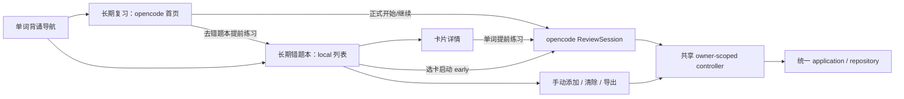

# 长期复习与长期错题本整合设计

日期：2026-10-05。状态：整合代码已实现，分支 codex/issue-45-review-notebook；已 rebase main a6b73d06，P6b/P6c 已有验收证据，iOS picker 实际交互仍阻塞。当前新增 P5.1 词形导入已实现，正在专项审查及完整回归。

## 1. 已确认需求与总体决策

用户要求：保留 opencode 的“长期复习”；保留 local 的“长期错题本”；复习流程倾向 opencode 为基础。用户进一步确认：完全不考虑旧数据库兼容性，不用保留原数据库。

主方案：**从 opencode 创建整合分支，保留它的复习 UI、主要复习业务规则及已验证 native 驱动；重新设计统一的长期四表 schema 与存储合同；按功能移植 local 错题本的界面和管理能力，统一接入重设计后的后端。**

“保留 UI”意味着保留页面布局、入口、功能、文案和交互主体；两个已复现故障、组件生命周期及 API 耦合必须调整。错题本保留 local 的列表/详情/手动添加/清除/导出；提前练习统一进入 opencode 的 ReviewSession。全应用只有一套长期学习排期和数据事实。

验收使用全新数据库，不实现旧数据识别、schema 转换、数据迁移、历史回执转换、兼容读取或双后端路由。没有删除用户原数据库；验收使用隔离 fresh 数据。旧六表数据库不属于支持合同，部署需明确使用新数据库，不能只切分支沿用旧结构。

## 2. 当前代码与实际合并成本

| 角色 | 固定分支提交 |
|---|---|
| 代码/复习基础 | issue/45-longterm-learning-opencode @ 286631a66d0abf037ced2b176e90e7e83c5fc753 |
| 错题本功能来源 | local/issue-45-longterm @ d7c1625320a990720d8cdb7921f6f4f177ad10bf |

共同祖先 cb2db77dd1821768600d0be9ba1d51d377a02bce。分支间 194 文件不同。Git merge-tree 预览发现 24 个冲突路径，集中在 app IPC、scheduler、storage-api、native driver、SQLite schema、六个长期表、LearningApp、普通拼写、appState 和样式。

因此工作方式采用有明确模块取舍的功能整合：以 opencode 为起点，逐个移植可独立验证的 local 功能，不把 local 全部提交直接 cherry-pick，也不以 ours/theirs 批量解决冲突。若最终需要两父提交的 merge commit，应在整合和验收结束后另确定历史策略，不能通过 merge -s ours 把未整合的 local 功能冒充已经合入。

当前主工作区仍有未提交 iOS 脚本/测试修改。实施时复用适合的隔离 worktree 或创建专用 worktree；不切换/重置当前工作区，不把这些修改带入整合范围。实际工作分支 codex/issue-45-review-notebook，目录 /Users/longda/.codex/worktrees/longterm-integration/quicklang；从 opencode 起步并 rebase 最新 main。尚未合入 main 或发布。

## 3. 页面与交互设计

### 3.1 菜单

```text
单词背诵
  …已有入口…
  生词表
  长期复习       ← opencode，保留 page id: longterm
  长期错题本     ← local，新增 page id: longterm-notebook
  学习进度       ← 保留原页面
```

菜单顺序优先沿用 opencode，只新增错题本入口。默认可用，不引入 local 已退休的 enable 设置。学习进度保留 opencode 原内容，不额外挂载第二份长期复习统计/会话。

### 3.2 长期复习

保留 opencode 的首页布局、四项指标、开始/继续复习、题目布局、提示/揭晓/跳过/放弃、Again 等待、完成页与返回首页。正式复习默认 20，维持现有 opencode UI 行为；后端 5–100 规则保留，本轮不新增数量配置。

首页“去错题本提前练习”导航到长期错题本。原 EarlyPractice 的重复列表选择页面被错题本列表替代；它的提前会话启动/继续能力接入共享 controller。正式和提前使用同一 opencode ReviewSession，标题与统计说明随 kind 区分。

### 3.3 长期错题本

保留 local 的列表布局、筛选、排序、下一页、跨页选择上限 100、手动添加、详情和隐私操作。详情保留词形/排期/首次掌握/累计易错次数/历史分页。

| 操作 | 目标行为 |
|---|---|
| 选 1–100 张 → 提前练习 | 冻结随机唯一 cardId，进入长期复习的 early 流程 |
| 详情 → 提前练习此词 | 同一 early 启动入口，显式传一张卡 |
| 已有 early 会话 | 显示继续现有会话；要换选词，先明确放弃已有会话再启动，不能暗中替换 |
| 正式会话未完成 | 返回长期复习可继续，不受错题本路由切换影响 |
| 添加成功 | 更新列表/统计并打开新增卡详情，保留 local 交互 |
| 删除单词/全部长期记录 | 明确范围、二次确认，成功后丢弃相关详情、选择、复习内容并重新读取 |
| 导出 | local 确认界面 + 原生保存位置选择 + 可取消 + 完成反馈 |
| 返回错题本 | 保留本 owner 的筛选/排序与选词；数据变动后失效旧 cursor，重新读第一页 |

长期学习不保留来源；移除来源展示、解析、分页、身份和按词书清除接口。

### 3.4 页面间状态

长期区域以 profile.id 为 key，owner 切换销毁旧 controller、取消播放和导出、清除详情/选择/提示。普通路由切换通过隐藏面板保留长期 controller；隐藏时停止播放与失效播放证明，下一次作答需重新播放。



## 4. 模块归属与保留范围

| 模块 | 整合决策 |
|---|---|
| opencode LongtermDashboard/ReviewSession、dashboard/session 展示规则 | 保留视觉与主要交互，修复已确认故障 |
| opencode useReviewSession/useActiveFormalSession/useLongtermDashboard | 提取读取、mutation 与 owner 生命周期；接入共享协调，不保留重复创建入口 |
| local notebook.tsx | 分成 Notebook/Detail/ManualAdd 等聚焦组件，移植 UI；改为统一 client |
| local LongtermArea | 借用常驻与控制组织方式，重写 composition；不把 local ReviewQuestion/useReview 作为第二套答题状态机复制进来 |
| local Confirmation/ExportConfirmation | 保留对话框交互、键盘焦点与隐私提示，适配 client |
| opencode application/domain/scheduler/storage-api/native/sqlite | 以现有分层和业务行为为基础，重构命令/查询/事务边界并适配新 schema；保留已验证 driver |
| local native longterm_export.m | 移植原生选取、协调与 security-scope 生命周期；不依赖 local 六表 schema |
| local audio.ts 与 speech onStart 支持 | 选择性移植播放开始证明、取消和降级，服务于 opencode ReviewSession |
| 普通拼写、appState、内置词库 | 保留上游行为与容量；普通错误使用 portable user document revision/CAS 和 epoch guard，长期事务与普通状态一并提交 |
| 全局桌面/iOS 布局和词库数据改动 | 不整体移植；只加入长期区域所需的局部 CSS |
| local 长期表/receipt/result_json/C bridge/sha2 配置 | 不整体移植；避免混入另一数据模型与已失败 native 路径 |
| 两分支文档/测试 | 保存来源与结论；挑选行为场景，重接目标接口，不照搬不同 DTO 的 mock |

建议 UI 文件落在 opencode 现有 shared/features/longterm 目录：新增 LongtermWorkspace、LongtermNotebook、LongtermCardDetail、LongtermManualAdd、ExportConfirmation、Confirmation、client、types 和 controller。具体是否进一步拆文件按职责决定，避免大 composition 文件。

## 5. 统一接口设计

### 5.1 边界

前端通过 shared/native/longterm.ts 的类型化适配调用统一 `longterm_command`；command 使用 userId、action 及 camelCase 字段，原生 worker 校验 epoch。普通错词还携带 portable user document 的 expectedVersion。导出有独立原生命令，不接收前端文件路径。

DTO 为 storage-api/longterm.rs 的 Card、Session、Item、Event 与 ActiveSession；查询/写入共用合同。类型映射不能伪造计数、游标、卡片身份或成功结果。当前实现入口是 shared/features/longterm/LongtermWorkspace.tsx，相关组件按职责拆分。
### 5.2 错题本需要的真实扩展

| 能力 | opencode 现有基础 | 本轮处理 |
|---|---|---|
| 卡片列表 | listCards + filter/sort/cursor | 统一使用 all/due/mastered 过滤；last_error → last_error_at，due → due_at；每页默认 50；不保留 unavailable/paused 过滤 |
| 完整详情 | 旧实现依赖 sources | 新 DTO 只返回独立 card/recentEvents 与原生 errorCount，不保留 displaySource |
| 历史分页 | longterm_list::list_card_events 已实现 repository 扩展方法，未有独立 IPC | 暴露 owner/card scoped IPC，复用原分页 SQL；不重新写事件引擎 |
| 手动添加 | 原实现依赖 sourceId/generation | 移除来源协议；新建随机卡片 ID，现存卡片去重；未知创建结果先查询，不自动重新创建 |
| 删除 | 原实现保留清除记录 | 仅单词/全部长期记录物理删除；历史与回执移除，不保存删除标记 |
| 精确会话恢复 | getActiveSessions 只返回 active | 增加按 sessionId 的 owner-scoped 读取，提供 active/terminal 状态及权威题目，供提交成功后读取恢复 |
| 导出 | 后端已有一致快照和原子发布，IPC 要 outputPath | 新增原生 picker command 与独立取消；对接既有编码和表投影 |

累计易错次数统一采用 opencode 原有 error_count 查询语义（普通错误 + 每个正式 session-item 首次 Again）；不能用 lapseCount 替代。分页 cursor 至少绑定 owner/card/查询参数；卡片删除后拒绝其旧 cursor，并由 UI 重启读取。

复习从独立卡片获得词形与题型；详情接口不再解析词书来源。

### 5.3 手动添加语义

遵循 opencode：新增手动卡 interval=1、dueAt=服务当前时间，可立即正式复习；local 新卡 dueAt=当前时间+24h 是另一语义，UI 移植不带入它。手动添加不算错、不加生词表、既有卡保留排期。

添加使用随机新候选 cardId；已有词按唯一约束去重，不绑定 sourceId/generation。创建响应未知先查询候选 ID，目标不存在不自动重试创建，新的明确用户动作可以重新添加。

local 的两个 UUID/result_json 回执不能照搬到 opencode；继续使用 opencode 的一次操作 UUID/事件机制。成功回执与后续页面读取分开处理：数据已提交但详情读取失败时，提示刷新，不将已提交写入显示为未保存。

## 6. 复习状态与已知故障修复

共享 controller 按 owner 和 sessionKind 分别保存 sessionId、服务状态、pending mutation、重试 payload 与 presentation key。正式/提前各最多一活动会话；启动只能来自用户动作，mount/refresh/foreground 只读取。读请求用 sequence 防止旧响应覆盖新状态；写请求在 owner 范围协调，冲突后重新读而不是悄悄改 CAS token。

### 6.1 完成页

提交回执的 session.state=completed/abandoned 时直接进入 terminal 展示，不再用 getActiveSessions 为空推断失败。有 event 已提交但 session 回读为空时，显示“已保存，正在恢复状态”，按 sessionId 读取；若它已被清除则清掉旧内容。不能用“活动会话没了”推断用户已经完成，可能是被放弃或被清除。

未知 transport 结果保留相同 operationId/payload；重试只用于确认写入结果。回执若为 replayed，读当前权威会话后展示，不能把历史回执当成最新 session。默认测试必须遵守活动接口只返回 active 的契约。

### 6.2 播放门槛

明确状态 preparing → started → ended/failed/cancelled。只有当前 presentation 的真实 onStart/playing 回调能打开评分门槛；调用 speak 或设置 audio=playing 不算播放证明。pending speech_render、播放拒绝、已取消的旧回调不得产生评分。

换题、重播、owner 切换、页面隐藏、确认操作均取消旧播放并失效证明。保留 opencode 原提示/揭晓/跳过的 Again 规则；无法播放时不制造学习错误。native/browser onStart 差异通过同一播放适配接口覆盖。

### 6.3 交叉管理操作

答题和放弃的未知结果在目标仍存在时冻结原命令；创建/添加未知结果先查候选 ID，不自动重新创建；删除不存在目标可即时返回已不存在，不保存或重放删除回执。进行答题写入期间不允许清除或替换选词；进行清除时禁用相关复习操作。清除成功后刷新 active sessions/四项统计/列表，并丢弃受影响题目、帮助状态、详情和选择。后端 CAS/owner 校验仍是最后一道边界，UI 禁用不是事务替代。

路由切换保留 controller 和未知写入 UUID；应用重启只恢复后端持久化会话，前端未确认 UUID 不宣称可跨重启恢复。

## 7. 导出整合

复用 local 原生保存选择器/协调能力与确认 UI，采用统一新库的编码/快照规则。不要直接复制 local Rust ExportRequest/ExportControl 及 schema encoders，因为它们依赖另一套 DTO 和 receipt 结构。

实际 `longterm_export_json` 接收 userId、operationId、includeRawAnswers、epoch，路径只由原生 capability 提供；`longterm_cancel_export` 撤销匹配能力。测试/内部 Action::Export 是 32 MiB 有限内存路径，生产原生文件直接流式输出。准确格式及平台限制见 [长期导出 v2](longterm-export.md)。

为 opencode exporter 增加生产级 cancellation control，分离于测试用 fail stage。取消信号直接触达共享 gate，不排在占用 storage worker 的 export 后面；批次/行/writer/publish 检查取消，最终取消与 rename 原子仲裁。Native lease 保持到写入或临时文件清理结束。

借用 local 的安全文件发布机制（独占临时文件、同目录原子 rename、symlink 边界），和新模型的四表公开投影/JSON 编码组合；建立新的导出合同并补充取消、失败保留原目标、空库、Unicode、原始答案省略与 owner 隔离测试。

**导出采用明确的 v2 格式。** 用户允许重设计数据库，因此输出按新模型建立准确公开 schema，不沿用两个分支同名而不同内容的 v1 格式。私有回执和控制字段不进入导出。

平台验收：macOS 保存/覆盖/取消；iOS 文档 provider 的 security scope、保存和取消；Windows 未实现原生保存时明确失败，不把浏览器下载路径当 native 验收。

## 8. 实施阶段与提交划分

| 阶段 | 工作与交付 | 验收门槛 |
|---|---|---|
| P0 基线准备 | 新整合分支/隔离检出、记录 SHA；冻结统一新 schema 与 fresh 数据；冻结产品范围 | 没有混入当前 iOS 未提交改动或 local driver/schema |
| P0.5 统一存储 | 四表 domain/DDL、row codecs、主事件回执、事务/CAS、直接删除与 export v2 合同 | seekdb/SQLite 相同合同；无旧库迁移；详情见统一存储设计 |
| P1 修复复习故障 | 完成状态恢复、按 sessionId 查询、真实播放开始证明 | 两个已失败补充探针转为默认回归，并通过真实后端状态合同 |
| P2 会话协调与路由 | owner-scoped controller、长期区常驻、两个菜单入口、列表→early 导航 | 切页/切用户/Again 等待/写入未知结果不会重建会话或改 UUID |
| P3 错题本读取 | 移植列表/详情；统一 DTO；事件 IPC、原生累计错误数 | 过滤/排序/跨页选择、cursor 失效、清除后的旧详情、跨 owner 访问测试 |
| P4 错题本管理 | prepare/add、单词/全部长期记录删除、确认对话框、刷新联动 | 添加不计错且不改既有排期，清除不影响普通进度/生词表，丢失响应不重复提交 |
| P5 原生导出 | picker、lease、取消 gate、既有 encoder/安全发布、准确 format schema | 保存/取消/错误路径、隐私投影、snapshot、现有目标保护 |
| P5.1 词形导入 | TXT/export v2/compact words v1 解析、当前用户预览、逐词 UUID、原子批次提交 | owner/epoch 迟到防护、已有卡排期和事件不变、批次回滚、身份冲突、删除后无跨词回执残留、未知结果不自动重试 |
| P6 整体验收 | 长期复习 + notebook 联合用例、原生构建、平台实测、最终代码审查 | 测试、构建和手工验收证据完整，无未解释 P1 |

每阶段形成聚焦功能提交，包含对应测试和必要说明。P1 是接入 UI 前的必要修复；P3 读功能与 P4 写功能分开提交；P5 不改 ordinary pipeline。执行可以复用已存在适合的 worktree，但不得在同一个 native 输出目录同时运行构建/测试任务。

本轮不启用数据库迁移项目；不顺带改 native C 绑定、旧 SM-2、词库内容、AI、iOS 安装脚本或全局页面样式。local 原 DB_LOCKED 问题保留为比较证据，不把失败 driver 整体引入主线；仍复跑最终 opencode 路径的缺表修复场景，防止接口接入影响稳定性。

## 9. 联合验收设计

必须覆盖实际业务链，而不只是两份 UI mock 套件相加。

1. 普通拼写答错 → 错题本出现独立卡片 → 四项统计反映原有口径。
2. 错题本手动加词 → 详情无普通错误事件 → 可正式/提前复习；重复添加不改排期。
3. 错题本跨页选词 → early 使用冻结列表 → Good/Again 不改正式 dueAt；已有 formal 不被替换。
4. 正式最后一题 Good → 后端 completed，活动查询为空 → 页面仍正确显示完成。
5. speech_render 未完成/失败、audio.play 拒绝、旧 onStart 到达 → 无评分事件；真正 started 后才可评分。
6. Again → 改路由/回前台/恢复会话 → 等待仍由服务时间决定；不重新选择、不延长/缩短等待。
7. 写入成功但响应丢失 → 切到 notebook 再回来重试 → 同 UUID，恰好一事件；终态可查询恢复。
8. 删除单词/全部长期记录 → 卡片、历史、回执物理移除，无删除标记；受影响会话删除；旧查询与重放不可用，同词新建新 ID。
9. 导出当前快照、取消/覆盖/失败/清除并发 → 文件内容和发布结果可验证；不泄露另一 owner 数据。
10. 用户切换 → 旧题目/答案/选词不可见，旧响应不可覆盖新 owner；旧导出取消且正确释放 native lease。
11. 大词库加载/普通错误/事件历史 → 不因 DTO 或导出移植缩小已支持的容量。
12. seekdb 与 host SQLite 执行相同后端合同；缺表修复/回滚重新通过。

测试顺序：先 focused UI/controller/backend 合同，再 `make test`，再相关真实数据库测试；Apple 改动完成后 `make test-apple` 的 canonical 构建按其内置流程执行，记录重叠与目标。若单独验收桌面构建用 `make build`，iOS 用 `make build_ios`；安装需要 Release 时才运行对应 Release 和安装目标。保留 build/增量产物，不清缓存或强制重建来“证明”复用。

Chrome 检查使用已安装 Chrome、workspace build 下隔离 profile 和 localhost debugging。覆盖两个页面桌面/移动尺寸、键盘焦点、隐藏面板、会话保留；mocked browser transport 不能替代 Tauri/设备验收。Million-event 性能门槛与普通回归区分，沿用原性能定义并另记录，不能把不同规模历史报告作为新通过结果。

## 10. 可交付结果与边界

最终交付应是一套可运行整合分支：两个指定页面、一个复习流程、一套重设计的统一数据模型，已知复习故障修复，新增 notebook 后端扩展与原生导出，配套联合测试/构建/设备验收记录。

整合分支已完成 P0–P5 与 P6b 验证，见 docs/analysis/p6b-verification-2026-10-05.md。最新 main a6b73d06 rebase 后，UI 932、make test、真实 seekdb 17 与两后端各 25 合同通过；桌面/iOS simulator Debug 构建和设备架构 check 通过。P7 文档校准与独立审查完成。iOS 真实文件夹选择交互因缺少 Simulator UI 应用仍阻塞，详见 docs/analysis/p6c-verification-2026-10-05.md。没有删除用户数据库、安装生产应用、合入 main 或发布。

## 11. 历史比较源码依据（不代表当前实现）

- [opencode 原菜单](/Users/longda/work/repo/myself/quicklang/build/branch-comparison/opencode/src/ui/src/shared/app/pages.ts:13)
- [opencode 复习 composition](/Users/longda/work/repo/myself/quicklang/build/branch-comparison/opencode/src/ui/src/shared/features/longterm/LongtermReview.tsx:20)
- [opencode 完成恢复问题](/Users/longda/work/repo/myself/quicklang/build/branch-comparison/opencode/src/ui/src/shared/features/longterm/useReviewSession.ts:208)
- [opencode 提交回执含终态](/Users/longda/work/repo/myself/quicklang/build/branch-comparison/opencode/src/app/src/longterm.rs:768)
- [opencode TS 详情目前只暴露 sources](/Users/longda/work/repo/myself/quicklang/build/branch-comparison/opencode/src/ui/src/shared/native/longterm.ts:641)
- [opencode 后端事件分页可复用](/Users/longda/work/repo/myself/quicklang/build/branch-comparison/opencode/src/crates/storage-common/src/longterm_list.rs:890)
- [opencode 手动新卡立即到期](/Users/longda/work/repo/myself/quicklang/build/branch-comparison/opencode/src/crates/storage-common/src/longterm_manual.rs:267)
- [opencode 导出编码/原子发布](/Users/longda/work/repo/myself/quicklang/build/branch-comparison/opencode/src/crates/storage-common/src/longterm_export.rs:432)
- [local notebook 详情与历史](/Users/longda/work/repo/myself/quicklang/build/branch-comparison/local/src/ui/src/shared/longterm/notebook.tsx:243)
- [local notebook 管理组合](/Users/longda/work/repo/myself/quicklang/build/branch-comparison/local/src/ui/src/shared/longterm/LongtermArea.tsx:242)
- [local 播放证明](/Users/longda/work/repo/myself/quicklang/build/branch-comparison/local/src/ui/src/shared/longterm/ReviewQuestion.tsx:59)
- [local 原生保存/协调](/Users/longda/work/repo/myself/quicklang/build/branch-comparison/local/src/app/native/longterm_export.m:45)

数据库重设计方案以 [统一存储 v2 设计](longterm-storage-v2-design.md) 为准：采用四张表（card/session/session_item/event），删除 source 和 tombstone，暂不增加独立 operation 表；原后端接口可复用其语义，但实现与 DTO 必须按新合同重新核对。

## 12. 合并中的相关代码重构

用户明确授权借本次合并重构相关代码，目标是逻辑清晰、职责合理。保留 opencode 长期复习、local 长期错题本和已约定业务行为；数据库重设计与已确认故障修复属于明确行为变更。重构范围限于长期学习及其必要调用链，避免夹带无关模块清理。

### 12.1 规范依据

2026-10-05 实际检查：`/Users/longda/.agents/AGENTS.md` 不存在；`/Users/longda/.codex/AGENTS.md` 的全局规范与用户在会话提供的规范一致。执行依据为该全局规范、用户提供的规范和仓库 AGENTS.md；实施开始前再次检查路径，如用户指定文件出现，应重新核对。

- 控制流、数据流显式，模块保持单向依赖；组合优先，不引入没有实际收益的抽象。
- 所有新增/修改代码注释使用英文；新增函数、方法、类在语言支持时提供简明英文文档注释，说明用途、重要参数、返回值、副作用和有意义的失败行为。Rust 使用 rustdoc，TypeScript 使用 JSDoc，其他语言采用对应文档形式。
- 长函数先识别阶段，抽取内聚职责；剩余重要阶段使用英文说明。函数长度和文件大小不作为机械拆分标准。
- 保持未授权变更的公共行为；接口有意调整时同步调用点、类型和测试。

### 12.2 模块责任

| 边界 | 负责 | 不应混入 |
|---|---|---|
| 页面与展示组件 | 长期复习、错题本、详情、表单和确认交互 | SQL、invoke、排期计算、重试身份生成 |
| 会话协调器 | 当前用户生命周期、命令状态、未知结果重试、页面切换后的恢复 | 卡片排期规则、导出文件实现 |
| 查询 hooks / view models | 列表/详情/统计读取、分页和显示映射 | 写入事务和第二套答题状态机 |
| 统一 native client | 类型化 IPC、错误映射、传输契约 | UI 状态和领域规则 |
| application commands / queries | 校验输入与用户、协调业务、定义事务所需工作、组装结果 | SQL 方言、组件状态 |
| domain / scheduler | 类型约束、排期、队列转换、统计口径等可独立验证规则 | 数据库连接、IPC、文件或音频副作用 |
| repository / transaction | 实现原子写入、引用验证、版本检查、幂等与清除规则 | UI 文案、播放器状态 |
| driver / codecs | 连接、SQL 执行、行编解码、方言差异 | 另一份正式/提前学习算法 |
| audio / export adapters | 播放开始/取消；文件选择、取消与发布资源生命周期 | 卡片状态和排期修改 |

这些是职责边界，不要求每行增加一个类或新 crate。优先复用现有模块，只有重复、生命周期或独立测试需求足以支持时才提取。SQL 方言差异集中处理，不建立通用 ORM 或插件框架。

### 12.3 优先重构内容

1. 将 local notebook 的列表、详情、添加和导出交互拆成聚焦组件，组合入口仅负责布局与连接。
2. 收敛长期区会话状态，正式与提前共用答题流程；查询 hooks 不隐式创建会话。创建、提交、放弃和重试通过明确命令进入。
3. 明确命令状态：未提交、提交中、已确认、失败、结果未知；未知结果保留原 UUID 与载荷，读取失败不伪装成写入失败。播放开始事实和提交结果分别建模。
4. 后端按复习、错题本查询、手动添加、清除、导出划分职责；command 编排显式调用纯规则及事务操作，不用一份巨大 longterm 文件处理全部流程。
5. 排期、首次 Again 计数、卡片存在性、删除影响范围和统计口径只保留一个实现；普通错误与手动添加复用稳定卡片逻辑，同时保留两者业务差异。
6. 清除与幂等在存储边界集中实现；四张表的写入不能分散成多个 IPC。数据库时间、身份和版本由后端提供，前端不重复计算。
7. 保留真实后端契约测试；修正不符合实际合同的 UI mock，特别是完成后 active session 为空、响应丢失、播放尚未开始等场景。

### 12.4 实施与验收

重构穿插到 P0.5–P5 的聚焦提交中，先记录原行为与失败用例，再调整边界，随后接入目标 UI。能独立验证的纯结构调整与行为修复分开提交；新 schema 改动必须与 codecs/仓储合同同步，避免制造无法运行的中间模型。

验收除已有联合用例外，还应检查：组件不直接 invoke；UI 不持有第二份排期算法；一次业务 mutation 具有一个原子事务边界；无重复会话创建入口；异常与资源释放路径清晰；新文档注释符合英文规范；模块拆分确实改善责任或测试，而非只减少行数。先跑针对性测试，再执行必要的项目测试及 canonical build；当前实现已有 P6b 证据；最新 main 衔接需要新的回归，不能直接沿用旧通过结果。

## 13. 最终简化决策（覆盖此前清除设计）

用户明确要求删除 source 和 tombstone。采用四表；不保存已删除单词的历史、操作回执、删除事件、占位行或任何删除标记。取消 generation/incarnation 与来源接口，卡片首次创建和同词重新添加均使用随机新 ID。删除受影响会话及队列，其他卡片排期保留；旧操作不查询、不重放、不转移至同词新卡。未知创建不自动重放。具体原子删除范围、统计变化和验收以统一存储 v2 设计为准。

## 14. 执行状态与本轮 main 衔接

P6b 在 origin/main 7e347898 基线上完成 make test、两后端合同、百万事件 Dev/SQLite 基准、隔离 WKWebView 桌面/移动布局及 macOS Debug canonical build。数字和日志见 docs/analysis/p6b-verification-2026-10-05.md。P6c 采用五个独立 subagent 任务分批并行，写同一 Cargo/Xcode 输出的任务串行；真实开始/结束与等待状态以看板为准，不采集 token。

最新 main a6b73d06 带入中文背诵/复习、统一 learning-activity 和正确奖励 earned。英文普通错词事务写同一 portable user document，活动只增加 spell，旧总数继承到 legacyDays；错误保留 earned，旧会话初始化累计值，避免换轮丢失奖励。中文 ASR 错误/超时继续不写错词、不计统计。

本轮追加跨日一致性设计：ordinary 命令冻结提交时本地 UTC offset；服务以 now + offset 计算 learning-activity 日期，事件与排期仍为 UTC。重试沿用冻结参数。该实现和跨日/重试回归已在 P6c 验证，详见 docs/analysis/p6c-verification-2026-10-05.md；不能以这些先前证据替代新增 P5.1 的验证。

导出默认不包含答案，四个数组中事件 answerRaw 为 null；没有来源与删除记录。P5.1 已实现长期 notebook 词形导入：UTF-8 TXT、export v2 JSON、compact words v1 JSON；32 MiB、去重前最多 10,000 词、每词 trim 后最多 256 Unicode code points，前后端都检查规范化后同样不超过 256 code points。预览目标为当前用户并绑定 epoch，文件 owner 不授权；现存卡保留排期与事件，新卡冻结新 UUID、使用初始排期，不重建当前复习队列。一个事务提交全部词，后半部失败整批回滚；只保留逐词 Add 回执，无批次/source/tombstone 表，不恢复文件旧历史。未知结果只允许核对和明确放弃，不自动重试创建。具体格式和交互见 [导入与导出合同](longterm-export.md)。新增功能完整回归仍以本轮最终日志为准。上游通用 portable user backup 与长期导出/导入是不同功能。

P6c 仍需 iOS picker 保存/替换/取消及 provider security scope 验收，真机尚无证据。mock 布局和 AppKit harness 不代表生产 iOS 端到端完成。百万事件基准仅五次样本、counting sink，未测磁盘 I/O 或峰值内存，不宣称 P95 或跨平台性能。Release 构建/安装未作为缓存预热执行。

文档任务开始：2026-10-05 19:34:19 +08:00。

文档任务结束：2026-10-05 19:40:15 +08:00；耗时 5 分 56 秒。仅修改本目录指定三份文档，无源码、测试或 Git 操作。
