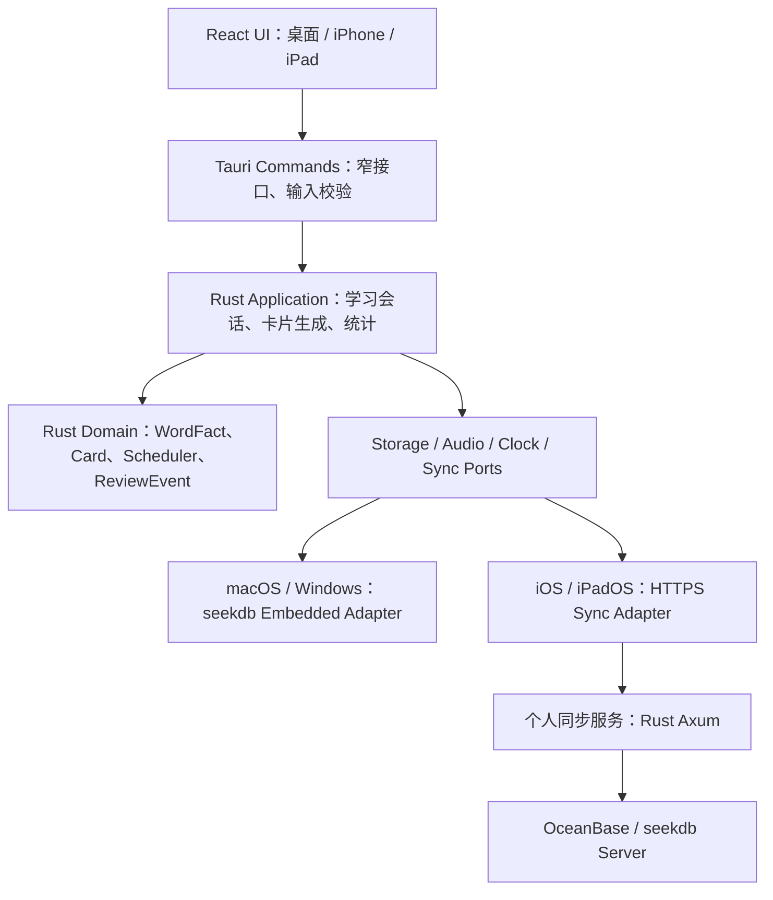
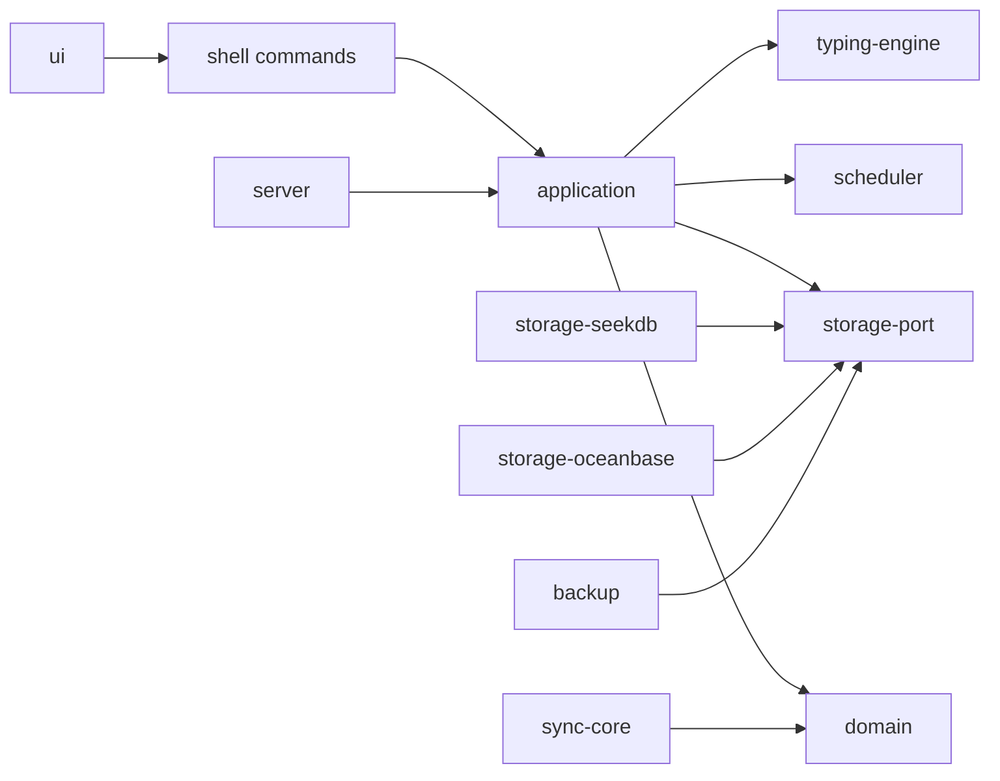

# QuickLang 个人背单词应用：产品与技术设计（v1.0）

> 状态：详细设计 v1.2（待技术预研与许可证审计验证）  
> 日期：2026-09-07  
> 目标平台：macOS 15+ / Apple Silicon；短期 iPhone、iPad；长期 Windows 11 x64  
> 数据原则：桌面端使用嵌入式 seekdb，不使用 SQLite；为迁移 OceanBase 服务端预留同构访问层

> 修订说明：v1.2 在 v1.1 工程设计的基础上，补充 Ink-Learner、Mnemosyne、LibreLingoRelive 的逐范围许可证矩阵、独立实现与直接衍生两条开发路径、AGPL 网络源码提供、Ink 内容署名、Apple 平台发布门禁和自动化合规检查。

## 1. 结论先行

QuickLang 应定位为一款**本地优先、键盘驱动、以长期记忆为核心的个人英语学习应用**，而不是课程网站或通用 Anki 替代品。

推荐技术路线为 **Tauri 2 + React/TypeScript + Rust 领域核心 + 存储端口**：

- macOS 首发为真正可安装的桌面应用（`.app` / `.dmg`），界面运行在系统 WebView 中，但不是浏览器网站；可保留 Ink-Learner 已验证的键盘练习交互与前端技术经验。
- iPhone/iPad 共用大部分 UI 与 Rust 领域逻辑，通过 Tauri 2 的 iOS 工程和 Xcode/TestFlight 发布。
- Windows 长期使用同一代码库生成安装包。
- macOS 使用嵌入式 seekdb。Windows 在 seekdb Windows 能力通过预研和稳定性门槛后使用同一路径。
- **当前 seekdb 没有官方 iOS 嵌入式构建/SDK。** 因而短期 iOS/iPadOS 版本应采用在线优先的同步 API，服务端使用 OceanBase/seekdb；设备上只保留系统偏好和可丢弃的加密文件队列，不引入 SQLite。若“iOS 必须完全离线且必须以 seekdb 持久化”是硬要求，则现阶段技术条件冲突，必须等待 seekdb iOS 支持或放宽其中一个约束。

本设计默认采用**独立实现路径**：吸收三个项目的产品思想和公开行为，不复制其 GPL/AGPL 源码；唯一计划直接复用的是 Ink-Learner 的学习素材，并将其作为 CC BY-SA 4.0 内容包独立管理。因此，QuickLang 自有代码在默认路径下**不因参考三个项目而自动变成 AGPL**。

如果后续决定复制、修改或组合 Mnemosyne / LibreLingoRelive 的实质性代码，则切换为**直接衍生路径**：QuickLang 组合程序采用 `AGPL-3.0-only` 作为发布总策略，保留每个上游文件的原许可证与声明，同时满足 Mnemosyne 的特殊署名条款。切换必须先通过第 17 节的许可证评审门禁，不能由开发者在普通 PR 中自行决定。

| 来源 | 吸收内容 | QuickLang 中的落点 |
| --- | --- | --- |
| Ink-Learner | 11 本英语词库、逐字符输入、章节学习、错词、统计、发音缓存 | 内容源与核心练习交互 |
| Mnemosyne | Fact/Card 分离、卡型派生、复习事件、可替换调度器、临时强化模式 | 领域模型与长期复习内核 |
| LibreLingoRelive | 内容一次定义、多题型生成、答错回队尾、内容校验流水线 | 练习生成器与内容构建工具 |

## 2. 产品目标与边界

### 2.1 目标

1. 让用户不仅“认识”单词，还能通过键盘或移动软键盘准确拼写。
2. 用卡片和间隔重复形成可持续的每日复习闭环。
3. 使用 Ink-Learner 的初中、高中、四级、六级、考研、托福、SAT、雅思、GRE、GMAT、BEC 共 11 本词库。
4. 核心学习在 macOS 本地完成；未来在 Apple 移动设备延续学习进度。
5. 数据访问层可从嵌入式 seekdb 切换至 OceanBase 服务，而不改动学习领域逻辑和 UI。

### 2.2 首版不做

- 不做公开课程社区、教师后台或多人协作。
- 不做开放插件市场和任意 HTML 卡面，避免首版引入脚本注入与兼容负担。
- 不做文章抓取、生成式 AI 补词义或社交排行榜。
- 不把向量检索作为 MVP 必需能力；seekdb 首先承担可靠的结构化持久化。语义例句检索可后置。
- 不承诺 iOS 离线完整词库和离线复习，除非 seekdb 获得受支持的 iOS 嵌入方案。

## 3. 关键架构决策

### ADR-001：选择 Tauri 2，而不是纯网页或 Electron

Tauri 2 能从同一代码库面向 macOS、Windows 和 iOS，支持平台安装包和 App Store/TestFlight 流程。它的 UI 使用系统 WebView，但产品形态是沙箱内的原生应用，文件、快捷键、通知、音频和数据库都通过受限的 Rust 命令访问。

Electron 易于接入 seekdb 的 Node 原生绑定，但无法覆盖 iOS；SwiftUI 最贴合 Apple 平台，却无法经济地覆盖 Windows；Flutter 是可行备选，但无法直接复用 Ink-Learner 的 React 交互，并且同样需要自行解决 seekdb FFI。综合迁移成本，Tauri 2 是当前最小风险选择。

### ADR-002：领域核心不得依赖具体数据库

领域层只依赖 `VocabularyRepository`、`ReviewRepository`、`SessionRepository`、`SyncRepository` 等 Rust trait。桌面实现为 `SeekDbEmbeddedAdapter`，服务端实现为 `OceanBaseAdapter`，测试实现为内存仓库。

禁止在 React 组件中拼 SQL，禁止向前端暴露通用 `db_query` / `db_execute`。每个 Tauri command 对应一个明确用例，例如 `start_session`、`submit_spelling`、`rate_card`、`get_daily_summary`。

### ADR-003：iOS 采用“同一领域模型、不同持久化拓扑”

截至 2026-09-07，seekdb 1.3.0 的官方发布覆盖 macOS ARM64、Windows 11 x64（实验性）和 Android（实验性），seekdb-js 的嵌入式预编译包覆盖 macOS ARM64、Windows x64、Linux，但未列出 iOS。因此：

- macOS：应用内嵌 seekdb，完全本地可用。
- iOS/iPadOS：通过 HTTPS 调用个人同步服务；短期为在线优先。允许用加密 JSONL 文件保存尚未上传的极小事件队列，它不是另一套数据库，服务恢复后可重放。
- Windows：先通过兼容性验证，再启用 seekdb embedded；若当时仍不满足稳定性要求，可临时连接个人服务，但不得静默回退到 SQLite。
- 长期服务：OceanBase 为权威数据源；存储适配器保持相同的领域实体和迁移版本。

## 4. 总体架构



### 4.1 模块职责

| 模块 | 职责 |
| --- | --- |
| `apps/ui` | 页面、响应式布局、逐字符视觉反馈、键盘与触控输入 |
| `crates/domain` | 实体、值对象、判题规则、复习状态机；不依赖 Tauri/数据库 |
| `crates/application` | 开始学习、选卡、提交答案、结束会话、导入词库等用例 |
| `crates/storage-port` | 仓库 trait、事务边界、分页与迁移协议 |
| `crates/storage-seekdb` | seekdb 嵌入式访问、DDL、备份、健康检查 |
| `crates/scheduler` | 可替换调度器与默认 SM-2 变体 |
| `crates/content` | Ink 词库解析、规范化、校验、版本清单与可重复导入 |
| `crates/sync` | 设备身份、变更日志、游标、幂等推送和冲突解决 |
| `apps/sync-server` | iOS/多设备 API，部署时连接 OceanBase/seekdb Server |

## 5. 学习领域模型

### 5.1 Fact 与 Card 分离

`WordFact` 是一条知识事实，保存单词、音标、词性、中文释义、例句、来源与规范化形式。`Card` 是事实的一个训练视角。一个单词可以派生多张卡，并拥有互相独立的复习状态。

首版卡型：

1. `MeaningToSpelling`：显示中文释义，用户拼写英文；默认主卡。
2. `AudioToSpelling`：播放读音，用户拼写英文。
3. `WordToMeaning`：显示英文，揭示释义后自评。
4. `SentenceCloze`：例句挖空目标词，用户拼写。
5. `SentenceTyping`：逐字输入完整例句；可在第二阶段交付。

卡型由 `CardTemplate` 声明，不复制事实字段。重新导入词库时更新 Fact，不销毁 Card 的学习历史。

### 5.2 复习调度

首版实现一个独立、可测试的 SM-2 变体，借鉴 Mnemosyne 的成熟概念而不复制其代码。每次复习产生不可变的 `ReviewEvent`，再更新 `ReviewState`：

- 评分：`Again(0)`、`Hard(2)`、`Good(4)`、`Easy(5)`。
- 首次学习、学习中、保持、遗忘四种状态分开处理。
- 存储到期时间、实际间隔、计划间隔、难易度、连续正确次数和遗忘次数。
- “临时强化”会产生会话事件，但默认不改变正式到期日。
- 以后可新增 FSRS 实现；历史事件足以重放和重新计算，不锁死在某个算法。

拼写模式可自动建议评分：一次准确且未提示为 Good；快速准确可建议 Easy；发生回退/改错为 Hard；提示、错误或跳过为 Again。用户可在结果页覆盖建议评分。

## 6. 三种核心学习模式

### 6.1 卡片复习模式

问题面 → 用户主动回忆/输入 → 展示答案与差异 → 评分 → 调度下一张。桌面支持数字键和空格快捷键，移动端显示大尺寸评分按钮。答错卡在若干张之后回到本次队列，但正式日程只提交一次最终评分，防止同一会话重复污染调度。

### 6.2 背诵拼写模式（强制键盘输入）

- 桌面必须由用户敲击实体键盘；iPhone/iPad 使用系统英文软键盘，也支持外接键盘。
- 默认提示为中文释义，可切换音频或例句挖空。
- 输入按 Unicode 字符归一化；英语首版忽略大小写，保留连字符和撇号规则。
- 每个字符即时显示：正确、当前、错误三种状态。错误不会直接自动跳过。
- `Backspace` 修改，`Tab` 请求一个字符提示，`Space` 重播发音，`Enter` 提交，`Esc` 暂停。
- 记录首次按键延迟、总耗时、错误字符数、回退次数、提示次数，而不仅是最终对错。
- 可配置“严格模式”：错误键不进入答案；“真实输入模式”：保留错误并允许回退。默认使用真实输入模式，更能反映拼写过程。

状态机：

```text
Preparing → Prompting → Typing → Evaluating → Feedback → Scheduling → Next
                              ↘ Paused ↗
```

### 6.3 自动默念模式（逐字自动拼出）

该模式不要求输入，默认静音，目标是让用户在脑中跟随拼写：

```text
Load word → Show prompt → Reveal letter 1..N → Hold full word → Show meaning/example → Next word
```

- 默认逐字间隔 350 ms，完整单词停留 1,200 ms，单词间隔 600 ms；均可调整。
- 可选择先显示释义、音标或例句；默认先释义后逐字拼出英文。
- 默认不播放声音；可选单词完成后播放系统 TTS 或已缓存音频。
- 支持顺序、随机、错词优先、到期卡优先和循环次数。
- 空格暂停/继续，左右键前后切词，上下键调整速度，`R` 重播当前词。
- 切到后台、锁屏或音频被打断时必须暂停，返回后由用户继续，不得在后台无提示跳过单词。
- 自动浏览本身不计为成功复习；只有用户主动确认“记住/模糊/不会”时才写入低权重事件，防止观看行为虚增掌握度。

## 7. Ink-Learner 词库接入

### 7.1 数据范围

导入 `seeds/ink/` 的 11 本词库：初中、高中、四级、六级、考研、托福、SAT、雅思、GRE、GMAT、BEC。构建期生成统一的 `content-manifest.json`，包括上游仓库、固定提交、词库版本、文件 SHA-256、词数、章节数、许可证和生成时间。

### 7.2 可重复导入流水线

```text
固定提交的 Ink seed
  → Schema 校验
  → 单词/音标/词性/释义规范化
  → 去重与来源合并
  → 例句引用检查
  → 生成稳定 ULID/内容哈希
  → 写入 seekdb 种子库或首次启动事务导入
```

规则：

- `normalized_spelling + language` 用于词条合并，原始拼写保留。
- 词库成员关系单独存储，一个词可属于多个词库/章节。
- 内容升级使用 `source_key + source_revision` 幂等 upsert，不删除用户自建内容。
- 删除或改名以 tombstone/alias 表达，避免孤立已有学习记录。
- 发版前输出重复项、空释义、非法章节、缺失许可证和哈希变化报告。

### 7.3 许可证边界

Ink-Learner 明确区分两类作品：程序源码为 GPLv3，`seeds/` 学习素材为 CC BY-SA 4.0；其致谢文件还说明部分例句源自 Tatoeba。QuickLang 默认只导入后者，不导入 Ink 的程序源码。

- 内容 manifest 对每一个词库记录上游 URL、固定提交、原文件、许可证、作者/署名主体、修改说明和 SHA-256。
- `dist/content/ink-*` 与应用二进制分开打包；内容包附带 CC BY-SA 4.0 正文、机器可读 manifest、原始署名和 QuickLang 的清洗/字段映射说明。
- 设置页提供“内容来源与许可证”；离线状态也能查看。不得只在项目网站或 GitHub 页面提供署名。
- 若分发包含全部或实质部分 Ink 数据的衍生数据库，衍生数据库按 CC BY-SA 4.0 共享；这不会仅因数据被应用读取而自动把独立的应用代码改成 CC BY-SA。
- Tatoeba 等二级来源逐项继承其实际许可证和署名要求；无法建立完整来源链的例句不进入正式包。
- Ink GPLv3 程序代码不进入默认构建。若未来确需使用，必须按第 17 节切换许可证路径并记录对应源码。

## 8. seekdb 数据设计

为兼容 OceanBase，使用 MySQL 兼容的保守 SQL 子集；主键使用应用生成的 26 字符 ULID，时间统一存 UTC 毫秒 `BIGINT`，枚举以短字符串保存。首版不依赖向量、FORK/MERGE 或仅 embedded 可用的扩展语法。

| 表 | 关键字段 | 用途 |
| --- | --- | --- |
| `schema_migration` | `version, checksum, applied_at` | 数据库迁移 |
| `wordbook` | `id, source_key, title, revision, license` | 词库元数据 |
| `chapter` | `id, wordbook_id, ordinal, title` | 章节 |
| `word_fact` | `id, language, spelling, normalized_spelling, phonetic, meaning, source_revision` | 单词事实 |
| `wordbook_entry` | `wordbook_id, chapter_id, fact_id, ordinal` | 词库成员关系 |
| `fact_example` | `id, fact_id, sentence, translation, source` | 例句 |
| `card` | `id, fact_id, card_type, template_version, suspended` | 派生卡片 |
| `review_state` | `card_id, phase, due_at, interval_days, ease, lapses, reps, version` | 当前调度状态 |
| `review_event` | `id, card_id, device_id, reviewed_at, rating, metrics_json, algorithm_version` | 不可变复习日志 |
| `study_session` | `id, mode, started_at, ended_at, source_filter_json` | 学习会话 |
| `study_attempt` | `id, session_id, card_id, answer, result, latency_ms, error_count, hint_count` | 逐题表现 |
| `user_setting` | `key, value_json, updated_at` | 偏好设置 |
| `sync_change` | `change_id, entity_type, entity_id, entity_version, device_id, changed_at, payload_json` | 增量同步 |

重要约束：

- `review_event.id`、`sync_change.change_id` 全局唯一，推送可安全重试。
- `review_state.version` 使用乐观并发控制。
- 内容表与用户学习表分离；升级词库不重置进度。
- 所有数据库访问经过显式事务和仓库 API。
- 迁移脚本启动前校验 checksum；失败时拒绝启动并保留备份。

### 8.1 备份与迁移

- 桌面端每日首次启动前生成一致性备份，保留最近 7 份和每月 3 份。
- 提供“导出个人学习数据”命令，输出版本化 JSON/JSONL + manifest，不将数据库目录复制视为唯一备份。
- 从 embedded 迁移至 OceanBase 时，先导出内容和事件，再服务端导入并核对表行数、事件哈希和每张卡的重放结果。
- seekdb 1.3.0 的发布说明指出从 1.0/1.1/1.2 不能原地升级，需逻辑迁移；因此 QuickLang 必须把逻辑导出/导入作为一等能力。

## 9. 多设备同步设计

个人同步服务使用 Rust/Axum，公开最小 API：

- `POST /v1/devices/pair`：一次性二维码配对设备。
- `POST /v1/sync/push`：批量幂等提交事件/实体变更。
- `GET /v1/sync/pull?cursor=...`：拉取游标后的变更。
- `GET /v1/content/manifest`：获取词库版本。
- `GET /v1/study/due-summary`：移动端启动时获取到期摘要。

同步以事件优先：复习事件只追加，不互相覆盖；用户设置采用最后写入者优先；卡片暂停状态使用实体版本；同一张卡在两台设备离线复习时，服务端按时间重放事件并返回新的 `ReviewState`。所有请求要求 TLS，设备令牌存 Keychain，服务端数据库凭据不进入客户端。

短期 iOS 在线优先意味着：无网络时允许浏览已经进入内存的当前小节和记录有限事件，但应用退出后的完整离线恢复不作为验收项。若需要稳定离线移动体验，应单独立项验证 seekdb iOS，不能用隐藏的 SQLite 实现绕过约束。

## 10. 主要页面与导航

1. **今日**：到期卡、新词额度、预计用时、连续天数、开始按钮。
2. **词库**：11 本 Ink 词库、章节、已学/待学/掌握数量、导入版本。
3. **学习**：卡片、背诵拼写、自动默念三种会话 UI。
4. **错词**：按错误次数、最近错误、到期时间筛选；可发起临时强化。
5. **统计**：正确率、首键延迟、拼写速度、遗忘次数、每日时长；不做虚假“记忆力评分”。
6. **设置**：每日新词、发音、自动默念速度、严格输入、备份、同步、许可证与数据导出。

桌面布局使用侧边栏和宽卡片；iPhone 使用底部导航和单列；iPad 使用 NavigationSplitView 风格的双栏。学习会话始终保持一个主要动作，避免把统计和设置带入输入焦点区域。

## 11. 代码仓库根目录结构（冻结）

仓库采用“少量根配置文件 + 六个职责明确的根目录”。所有产品源码必须进入 `src/`，所有测试必须进入 `tests/`，所有自动化脚本必须进入 `scripts/`，构建所需的第三方依赖材料必须进入 `deps/`，文档源文件必须进入 `docs/`。`repos/` 是只读参考源码区，不属于 QuickLang 的编译输入。

```text
quicklang/
├── Makefile                         # 所有常用开发入口；仅做任务编排
├── README.md                        # 项目入口、五分钟启动、许可证摘要
├── LICENSE                          # QuickLang 自有源码许可证
├── LICENSE_POLICY.md                # 路径边界、许可证矩阵、贡献规则
├── NOTICE.md                        # 上游版权、署名、修改与链接汇总
├── SOURCE_OFFER.md                  # AGPL/GPL 路径启用时的对应源码入口
├── Cargo.toml                       # Rust workspace，仅引用 src/ 下成员
├── Cargo.lock                       # 锁定 Rust 依赖
├── rust-toolchain.toml              # 固定 Rust channel/components/targets
├── package.json                     # npm workspace：src/ui 与 docs
├── package-lock.json                # 锁定前端和文档站依赖
├── .env.example                     # 非秘密环境变量说明
├── .editorconfig
├── .gitignore
├── .github/
│   └── workflows/                   # CI、文档站和发布流水线
│
├── src/                             # QuickLang 全部产品源码
│   ├── ui/                          # React + TypeScript 共享 UI
│   ├── shell/                       # Tauri 2 桌面/移动壳
│   ├── server/                      # Rust/Axum 个人同步服务
│   ├── crates/                      # Rust 领域与基础设施 crates
│   ├── migrations/                  # seekdb/OceanBase 版本化迁移
│   └── content/                     # 构建期词库清单、Schema、生成结果描述
│
├── tests/                           # 所有测试代码与测试数据
│   ├── unit/
│   ├── contract/
│   ├── integration/
│   ├── e2e/
│   ├── platform/
│   ├── fixtures/
│   └── benchmarks/
│
├── scripts/                         # 可直接执行的工程脚本
│   ├── bootstrap/
│   ├── build/
│   ├── install/
│   ├── test/
│   ├── docs/
│   ├── content/
│   ├── database/
│   ├── compliance/                  # 许可证、NOTICE、SBOM、源码包检查
│   ├── release/
│   └── lib/
│
├── deps/                            # 构建/运行依赖的受控第三方材料
│   ├── manifest.lock.json
│   ├── checksums/
│   ├── licenses/
│   ├── patches/
│   ├── seekdb/
│   ├── cache/                       # make init 下载；gitignore
│   └── README.md
│
├── docs/                            # 文档源与 VitePress 静态站
│   ├── .vitepress/
│   ├── product/
│   ├── architecture/
│   ├── development/
│   ├── operations/
│   ├── decisions/
│   ├── reference/
│   ├── public/
│   └── index.md
│
├── repos/                           # 解压生成的只读参考源码；默认 gitignore
├── repos.gz                         # 可选参考源码归档；不进入构建与发布包
├── build/                           # 中间产物、覆盖率、生成文档；gitignore
└── dist/                            # 最终安装包和内容包；gitignore
```

### 11.1 根目录强约束

1. 根目录不直接存放 `.rs`、`.ts`、`.tsx`、SQL、测试或业务脚本。
2. `src/` 只放 QuickLang 自有产品源码；第三方源码不得复制进来。
3. `tests/` 可以依赖 `src/` 暴露的公共测试接口，`src/` 不得反向依赖 `tests/`。
4. `scripts/` 只做编排、生成、校验和打包；核心业务规则不得藏在脚本中。
5. `deps/` 是受版本、哈希和许可证控制的构建依赖区；不得作为随手下载目录。
6. `docs/` 中的 Markdown 是文档事实源；生成的网站只写入 `build/docs/site/`。
7. `repos/` 中的项目仅供阅读、比对和测试思路参考，不可被 Cargo/npm workspace 引用，不可进入制品。
8. `build/` 与 `dist/` 都可安全删除并重新生成；用户数据永远不写入仓库目录。
9. 默认路径禁止将 GPL/AGPL 上游源码提交到 `src/`；例外必须由许可证 ADR 明确到文件、来源提交和适用条款。

## 12. `src/` 源码详细设计

### 12.1 `src/ui/`：共享界面

```text
src/ui/
├── package.json
├── tsconfig.json
├── vite.config.ts
├── index.html
└── src/
    ├── app/                         # 路由、应用启动、错误边界、生命周期
    ├── pages/                       # today、library、study、errors、stats、settings
    ├── features/
    │   ├── study-session/           # 会话壳和键盘焦点管理
    │   ├── spelling/                # 用户逐字符拼写
    │   ├── auto-recite/             # 自动默念逐字展示
    │   ├── flashcard/               # 卡片正反面与评分
    │   ├── wordbook/                # 词库和章节
    │   ├── review/                  # 到期卡、强化复习
    │   ├── statistics/
    │   └── settings/
    ├── components/                  # 无业务状态的通用组件
    ├── adapters/                    # Tauri command、HTTP、TTS 适配器
    ├── stores/                      # 仅 UI/会话状态，不保存领域真相
    ├── contracts/                   # 与 Rust command 对应的 DTO 和错误码
    ├── i18n/
    ├── styles/
    └── assets/
```

UI 不能访问数据库文件，不能拼 SQL，不能直接计算下次复习时间。它只能调用有语义的 command。DTO 由 Rust Schema 自动生成 TypeScript 类型，CI 校验生成文件是否与源码同步。

键盘事件只由当前激活的学习 feature 捕获；全局快捷键不得吞掉输入法组合事件。桌面和移动共享状态机，但通过 `DeviceCapabilities` 决定是否显示实体键盘提示、软键盘按钮、触觉反馈和窗口操作。

### 12.2 `src/shell/`：Tauri 2 应用壳

```text
src/shell/
├── Cargo.toml
├── build.rs
├── tauri.conf.json
├── tauri.macos.conf.json
├── tauri.ios.conf.json
├── tauri.windows.conf.json
├── capabilities/
│   ├── desktop.json
│   └── mobile.json
├── icons/
└── src/
    ├── main.rs
    ├── lib.rs
    ├── bootstrap.rs
    ├── commands/
    ├── lifecycle/
    ├── keychain/
    ├── audio/
    ├── paths/
    └── diagnostics/
```

`bootstrap` 严格按以下顺序启动：解析应用数据目录 → 获取进程锁 → 检查上次未完成恢复 → 打开 seekdb/远程适配器 → 校验迁移 → 注册服务 → 暴露 commands → 显示窗口。任一步失败时显示可恢复错误页，不启动半可用学习会话。

Tauri command 按用例命名，首版接口如下：

| Command | 请求 | 返回 | 事务边界 |
| --- | --- | --- | --- |
| `get_dashboard` | 日期、设备时区 | 今日摘要 | 只读快照 |
| `list_wordbooks` | 分页、过滤 | 词库摘要 | 只读 |
| `start_study_session` | 模式、词库/章节、数量 | 会话和第一张卡 | 创建会话事务 |
| `submit_spelling` | 会话、卡片、答案与输入指标 | 差异、建议评分 | 写 attempt，不结算日程 |
| `rate_card` | 会话、卡片、评分 | 新状态、下一张卡 | event + state 原子提交 |
| `control_auto_recite` | pause/resume/next/previous/speed | 播放状态 | 通常不写库 |
| `finish_study_session` | 会话 ID、原因 | 结算摘要 | 关闭会话事务 |
| `list_due_cards` | 过滤、游标 | 卡片页 | 只读 |
| `create_backup` | 可选目标 | 备份清单项 | 独占维护操作 |
| `restore_backup` | 备份 ID | 待重启标记 | 不在线替换数据库 |
| `sync_now` | 可选批次限制 | 同步摘要 | 多个短事务 |

错误统一为 `{ code, message, retryable, details? }`。`message` 可本地化，程序逻辑只判断稳定的 `code`，例如 `DB_LOCKED`、`MIGRATION_REQUIRED`、`SESSION_STALE`、`SYNC_OFFLINE`、`CONTENT_INVALID`。

### 12.3 `src/crates/`：Rust 核心

```text
src/crates/
├── domain/                          # 零 I/O 的领域对象和值对象
├── application/                     # 用例、事务协调、权限与幂等
├── scheduler/                       # SM-2 变体及未来 FSRS
├── typing-engine/                   # 字符归一、差异、输入指标
├── content-model/                   # 词库 Schema、规范化、稳定 ID
├── storage-port/                    # Repository/UnitOfWork trait
├── storage-seekdb/                  # 嵌入式 seekdb 实现
├── storage-oceanbase/               # 服务端 OceanBase 实现
├── sync-core/                       # 事件、游标、冲突解决
├── backup/                          # 逻辑导入导出与一致性校验
├── observability/                   # 本地结构化日志与健康检查
└── test-support/                    # 只供 tests 使用的 builder/clock/store
```

依赖方向必须保持：



`domain` 不依赖 Tauri、HTTP、seekdb、系统时钟或随机数；时钟、ID 生成器和随机排序都通过端口注入。`storage-seekdb` 与 `storage-oceanbase` 必须通过同一套 repository contract tests。

### 12.4 `src/server/`：个人同步服务

```text
src/server/
├── Cargo.toml
└── src/
    ├── main.rs
    ├── config.rs
    ├── routes/
    ├── auth/
    ├── sync/
    ├── content/
    ├── health/
    └── middleware/
```

服务端只处理认证、请求校验、幂等、同步协调和 OceanBase 事务，不重新实现学习算法。客户端和服务端调用相同的 `application/domain/scheduler` crates，以避免同一事件在两端得到不同日程。

### 12.5 `src/migrations/` 与 `src/content/`

```text
src/migrations/
├── embedded/                        # seekdb embedded
│   ├── V0001__baseline.sql
│   └── V0002__review_events.sql
├── server/                          # OceanBase 差异脚本；尽量为空
└── manifest.json                    # 顺序、哈希、最低应用版本

src/content/
├── schema/                          # JSON Schema
├── manifests/                       # 固定来源、提交、许可证、哈希
├── mappings/                        # Ink 字段到领域字段的显式映射
└── generated/                       # 构建期元数据；不放数据库二进制
```

迁移只向前执行，禁止应用启动时自动回滚。每次迁移前生成逻辑备份；迁移校验失败时保持旧库和可诊断日志。词库导入与数据库迁移是两条独立版本线：前者由 `content_revision` 管理，后者由 `schema_version` 管理。

## 13. `tests/` 测试代码详细设计

测试代码集中在根 `tests/`，生产目录只允许最小的 `#[cfg(test)]` 白盒测试；跨模块测试、夹具和快照都必须在根测试目录。

| 目录 | 内容 | 是否需要真实 seekdb |
| --- | --- | --- |
| `tests/unit/rust` | 领域、调度、输入算法 | 否 |
| `tests/unit/ui` | React 组件、hooks、状态机 | 否 |
| `tests/contract` | Repository、Clock、Audio、Sync 契约 | seekdb 套件需要 |
| `tests/integration/database` | 迁移、事务、索引、崩溃恢复、备份 | 是，临时数据目录 |
| `tests/integration/content` | 11 本词库解析、幂等导入、升级 | 是 |
| `tests/integration/sync` | push/pull、幂等、冲突、游标 | embedded + server |
| `tests/e2e` | 用户旅程、键盘、暂停恢复、设置 | 打包后的测试应用 |
| `tests/platform/macos` | 应用签名、路径、Keychain、系统 TTS | macOS runner |
| `tests/platform/ios` | 真机/模拟器生命周期、软键盘、旋转 | Xcode runner |
| `tests/platform/windows` | WebView2、安装器、数据目录 | Windows 11 x64 |
| `tests/fixtures` | 小词库、事件序列、损坏备份、黄金结果 | 否 |
| `tests/benchmarks` | 启动、选卡、批量导入、查询延迟 | 可选独立任务 |

测试隔离规则：

- 每个数据库测试使用随机临时目录，测试结束只删除自己创建且已验证的路径。
- 禁止测试连接开发者日常数据库；测试适配器要求 `QUICKLANG_TEST=1` 和路径中存在测试哨兵文件。
- 时间统一使用 `FakeClock`，随机顺序使用固定 seed。
- 夹具词库只包含可公开的最小样例，不复制完整 Ink 数据。
- 黄金调度用 JSONL 表达输入事件和期望状态，算法升级必须显式更新版本和快照。
- `make test` 不访问公网；需要外部服务的测试放到显式 `make test-online`。

## 14. `scripts/` 工程脚本详细设计

```text
scripts/
├── bootstrap/
│   ├── init.sh                      # macOS/Linux/CI 初始化
│   ├── init.ps1                     # Windows 对等实现
│   ├── doctor.sh                    # 只读环境诊断
│   └── fetch-deps.sh                # 下载并校验 seekdb 等依赖
├── build/
│   ├── app.sh                       # 当前平台 release build
│   ├── ui.sh
│   ├── server.sh
│   └── content.sh
├── install/
│   ├── local.sh                     # macOS 当前用户安装
│   └── local.ps1                    # Windows 当前用户安装
├── test/
│   ├── all.sh
│   ├── rust.sh
│   ├── ui.sh
│   ├── integration.sh
│   └── content.sh
├── docs/
│   ├── site.sh                      # build/serve/check
│   └── link-check.sh
├── content/
│   ├── unpack-references.sh         # repos.gz → repos/，只读参考
│   ├── import-ink.sh
│   ├── validate.sh
│   └── license-report.sh
├── database/
│   ├── migrate.sh
│   ├── logical-export.sh
│   ├── logical-import.sh
│   └── verify-backup.sh
├── release/
│   ├── package.sh
│   ├── notarize-macos.sh
│   ├── sign-windows.ps1
│   └── checksums.sh
└── lib/
    ├── common.sh
    └── common.ps1
```

所有脚本必须支持 `--help`，启用严格错误处理，打印所处阶段，但不得输出 token、证书内容或完整用户路径。脚本必须可重复执行；下载使用临时文件，校验成功后再原子移动到 `deps/cache/`。

Makefile 不承载复杂 shell 逻辑，只调用这些脚本。bash 与 PowerShell 对等脚本共享输入/输出契约；若行为不同，必须在 `docs/development/platform-matrix.md` 记录。

## 15. `deps/` 第三方依赖管理

`deps/` 只保存 QuickLang 构建或运行真正需要的外部材料：

```text
deps/
├── manifest.lock.json               # 名称、版本、来源 URL、平台、SHA-256、许可证
├── checksums/                       # 上游发布校验与 QuickLang 锁定校验
├── licenses/                        # 每个分发组件的许可证原文/NOTICE
├── patches/                         # 必要补丁；一个补丁一个说明文件
├── seekdb/
│   ├── README.md                    # FFI/sidecar 接入与平台矩阵
│   ├── include/                     # 固定版本公开头文件（若 FFI）
│   └── platform-manifest.json       # darwin-arm64、win-x64 制品映射
└── cache/                           # 下载的库/二进制；不提交 Git
```

规则：

1. `make init` 只根据 `manifest.lock.json` 获取固定版本，不使用 `latest`。
2. 每个文件先验证 SHA-256，再参与编译或打包。
3. CI 生成 SBOM 和第三方许可证清单，并验证发布包中的依赖与 manifest 一致。
4. 不允许把 Homebrew/系统全局安装的 seekdb 当作正式构建输入。
5. 补丁必须记录上游版本、原因、应用顺序和移除条件。
6. Node/Rust 普通包仍由各自 lockfile 管理；只有需要显式分发、FFI、补丁或许可证归档的材料进入 `deps/`。
7. `manifest.lock.json` 增加 `license_expression`、`source_url`、`source_revision`、`modified`、`notice_path` 和 `redistribution_scope`；未知或自定义许可证阻断发布。

## 16. `repos/` 参考源码隔离

当前仓库根目录存在 `repos.gz`，归档内包括 Ink-Learner 的词库、文档和源码等参考材料。开发时可运行 `make refs` 或 `scripts/content/unpack-references.sh` 解压为 `repos/`。

`repos/` 的使用规则：

- 仅用于理解交互、数据格式、边界情况和测试思路。
- 默认加入 `.gitignore`，不参与 `Cargo.toml`、npm workspace、include path 或运行时资源配置。
- 禁止从 `repos/` 直接复制 GPL/AGPL 源文件到 `src/`；确需采用实现时必须先切换到第 17.3 节的直接衍生路径，完成许可证 ADR、来源记录和维护者沟通。
- Ink 词库进入产品时必须经过 `scripts/content/import-ink.sh`、字段映射、许可证报告和内容哈希，不允许运行时直接读取 `repos/ink-learner/seeds`。
- `make clean` 不删除 `repos/`；`make clean-refs` 只在显式确认目标为仓库内 `repos/` 后删除生成目录。
- CI 和发布构建不依赖 `repos.gz`；正式内容输入应有独立、可审计的内容获取流程。

## 17. 许可证与二次开发合规设计

本节是工程约束，不是法律意见。公开发布、商业分发或提交 App Store 前，应由熟悉开源软件和目标地区法律的专业人士复核实际制品及当时的平台条款。

### 17.1 上游许可证矩阵

| 上游范围 | 仓库中的声明 | QuickLang 计划用途 | 主要义务与结论 |
| --- | --- | --- | --- |
| Ink-Learner `src/`、`src-tauri/` | GNU GPLv3 | 默认不复制 | 若复制/修改并分发，保留声明、标注修改并按 GPLv3 提供对应源码；与 AGPLv3 代码组合时可按两份许可证的兼容条款形成 AGPL 组合程序 |
| Ink-Learner `seeds/` | CC BY-SA 4.0 | 导入 11 本词库 | 署名、许可证链接/正文、标注修改、同方式共享衍生内容/数据库；与应用代码分离 |
| Ink 词库中的二级来源 | 以实际 manifest 为准；已知包括 Tatoeba 署名链 | 仅使用来源清楚的条目 | 保留逐来源署名与许可证；不以 Ink 的总声明覆盖二级来源要求 |
| Mnemosyne 主体代码 | GNU AGPLv3，且根许可证增加可见名称条款 | 默认只参考概念 | 若使用不可忽略（non-trivial）的代码，除 AGPL 外还要让 “Mnemosyne” 在衍生作品中清晰可见，并与维护者商定具体形式；未取得书面澄清前不得直接复用 |
| Mnemosyne `openSM2sync` | GNU LGPLv3 | 默认不使用 | 如动态/静态组合，按 LGPLv3 的重新链接、修改源码和通知要求单独评审 |
| LibreLingoRelive 软件 | GNU AGPLv3 | 默认只参考内容生成思想 | 复制/修改/组合代码时，分发需提供对应源码；修改后的联网程序还需向远程交互用户显著提供免费源码入口 |
| LibreLingo 课程/创意内容 | 由每个内容包自行指定 | 默认不导入 | 不假定为 AGPL；逐包读取并执行实际许可证 |

“界面相似”“实现同一算法”是否构成衍生作品取决于实际表达、复制程度和适用法律，不能仅靠目录隔离得出结论。因此默认路径还要求提交者声明实现来源，并禁止从参考仓库粘贴代码、注释、测试数据和具有独创性的文档段落。

### 17.2 路径 A：独立实现（默认、推荐）

适用于当前设计：团队从需求、公开行为和学术/协议说明重新实现 Fact/Card、调度、答错回队及练习生成器，不复制三个上游的软件源码。

1. QuickLang 自有程序代码采用项目自主选择的许可证；当前建议 `Apache-2.0`，便于未来桌面、移动、Windows 和服务端部署。正式写入根 `LICENSE` 前由项目所有者确认。
2. Ink 内容包继续使用 `CC-BY-SA-4.0`，其许可证不延伸到边界清楚、独立创作的 QuickLang 程序代码。
3. 新增 `docs/reference/provenance.md`，按功能记录“参考的产品行为/公开资料”和“独立实现文件”，审查 PR 中与 `repos/` 的异常文本相似度。
4. 不将 Mnemosyne 或 LibreLingoRelive 作为编译依赖、运行时插件、复制代码来源或代码生成模板。
5. 这一路径符合上游许可证的边界，且最有利于未来采用 Apple App Store、企业签名或其他带额外分发条款的渠道。

### 17.3 路径 B：直接衍生（显式切换）

若项目目标改为直接修改/组合 Mnemosyne 或 LibreLingoRelive，则执行以下不可拆分的门禁：

1. 新建许可证 ADR，列出每个采用文件的上游 URL、固定提交、版权声明、原许可证、修改日期和修改摘要。
2. QuickLang 新增的组合程序代码采用 `AGPL-3.0-only`；不得把上游 `GPL-3.0-only`、`LGPL-3.0-only` 或自定义条款文件简单改头为 AGPL，原文件仍保留原声明。
3. 发布二进制时，向每位接收者提供完整对应源码，包括构建/安装脚本、接口定义、QuickLang 修改和许可证文本；源码必须与发布 tag、commit 和制品校验和一一对应。
4. 同步服务或其他修改后的 AGPL 程序允许用户经网络交互时，在每个可用客户端的“关于/许可证”以及服务入口显著提供“获取此版本源码”，无需登录、无需付费，链接指向可下载的精确版本源码。
5. 交互界面保留适当法律声明，并明确标注 QuickLang 对上游代码的修改及日期。
6. 采用 Mnemosyne 不可忽略（non-trivial）的代码前，先取得维护者对名称展示形式的书面确认；在设置/关于页、文档站和发布说明中按确认方案显著展示 “Mnemosyne”。未完成时发布任务失败。
7. GPLv3 与 AGPLv3 可组合不代表所有文件都能统一改成 AGPL，也不消除 Mnemosyne 附加条款、内容许可证或第三方依赖的各自义务。

### 17.4 私有使用、分发与联网触发点

- 仅在个人设备上私下修改和运行，通常不产生向公众发布源码的义务；把仓库设为 private 也不等于规避之后的分发义务。
- 把应用二进制、安装包或设备预装版本交给其他人时，GPL/AGPL 对应源码义务即需要按实际许可证执行；不能只给一个无法构建的代码快照。
- 对修改后的 AGPL 程序，远程用户通过网络与其交互时，即使未收到服务器二进制，也必须看到并能使用对应源码入口。
- 纯粹的、边界清楚的独立协议客户端与 AGPL 服务端不当然采用同一许可证；若共享代码、紧密链接或共同形成一个程序，则必须重新评审，不能把 IPC/HTTP 当作自动免责线。

### 17.5 Apple 平台发布门禁

iOS/iPadOS App Store 的 EULA、Usage Rules、签名和技术保护措施可能与 GPL/AGPL 赋予接收者的复制、修改和再分发权发生冲突。设计上不得将“能通过 TestFlight 构建”等同于“许可证允许正式上架”。

- 路径 A：应用代码无 GPL/AGPL 组合依赖；Ink 内容仍提供 CC BY-SA 署名、许可证和可下载内容包。上线前复核 CC BY-SA 的“不得增加限制”与实际商店交付方式。
- 路径 B：进入 App Store 前必须取得上游版权方的额外授权/双重许可，或由法律审查确认具体发布条款可同时满足；否则只允许开发签名、个人安装或另选合规分发渠道。
- macOS App Store 与 iOS App Store 分别审查；macOS 官网公证包、TestFlight、App Store 不能共用一份笼统结论。

### 17.6 仓库制品与用户界面

| 位置/制品 | 必须内容 |
| --- | --- |
| `LICENSE` | QuickLang 自有代码许可证；不得冒充覆盖全部第三方内容 |
| `LICENSE_POLICY.md` | 本节的可执行摘要、默认路径和切换审批人 |
| `NOTICE.md` | 上游项目、版权、固定版本、修改说明和链接 |
| `SOURCE_OFFER.md` | 路径 B 下各发行版本的源码 URL、tag/commit、有效期和获取方式 |
| `deps/licenses/` | AGPLv3、GPLv3、LGPLv3、CC BY-SA 4.0 及所有实际依赖的许可证原文 |
| `src/content/manifests/` | 每个内容包和二级来源的机器可读 provenance、许可证与哈希 |
| 应用“关于/许可证” | 离线可查看 NOTICE；按内容包查看署名；路径 B 显著显示对应源码链接和 Mnemosyne 名称 |
| 静态文档站 | `/licenses/`、`/source/`、内容来源、修改历史和精确版本下载入口 |

### 17.7 自动化门禁与验收

新增 `make license-check`，并由 `make test`、`make build` 和发布任务调用：

1. 扫描 `src/` 与 `repos/` 的文件哈希、长文本和许可证指纹，默认路径发现疑似复制则失败。
2. 验证所有依赖及内容项都有 SPDX 表达式、来源、固定版本、NOTICE 和许可证原文。
3. 验证路径 B 的发行 tag 存在可重现的对应源码归档，且应用与服务中的源码链接返回精确版本而非仅指向默认分支。
4. 运行安装包解包测试，确认许可证、NOTICE、内容署名和源码入口实际进入 macOS/iOS/Windows 制品。
5. 生成 `build/compliance/sbom.cdx.json`、`third-party-notices.html`、`content-attribution.json` 和 `source-bundle.sha256`。
6. 发布审批表必须记录 `license_profile=clean-room|agpl-derived`；值缺失、混用或待确认时禁止生成 Release。

## 18. `docs/` 与静态网站

文档使用 Markdown + VitePress。选择 VitePress 是因为项目已经需要 Node/Vite/TypeScript，减少额外 Python 文档工具链；输出是可部署到 GitHub Pages、对象存储或任意静态 Web Server 的纯静态文件。

```text
docs/
├── package.json                     # 可作为 npm workspace，也可只用根依赖
├── index.md                         # 产品简介与文档导航
├── .vitepress/
│   ├── config.ts                    # title、nav、sidebar、base、搜索
│   ├── theme/
│   │   ├── index.ts
│   │   └── custom.css
│   └── cache/                       # gitignore
├── product/
│   ├── vision.md
│   ├── requirements.md
│   └── user-journeys.md
├── architecture/
│   ├── overview.md
│   ├── modules.md
│   ├── data-model.md
│   ├── sync.md
│   └── security.md
├── development/
│   ├── getting-started.md
│   ├── repository-layout.md
│   ├── make-targets.md
│   ├── testing.md
│   └── platform-matrix.md
├── operations/
│   ├── backup-restore.md
│   ├── diagnostics.md
│   └── release.md
├── decisions/
│   ├── README.md                    # ADR 索引
│   ├── 0001-tauri-2.md
│   ├── 0002-seekdb.md
│   └── 0003-mobile-storage.md
├── reference/
│   ├── command-api.md               # 从 Rust Schema 生成
│   ├── database-schema.md           # 从迁移生成
│   ├── content-format.md
│   └── licenses.md
└── public/                          # favicon、架构图片等静态资源
```

### 18.1 文档构建契约

- `make docs`：校验链接、生成 API/数据库参考、执行 VitePress build，输出 `build/docs/site/`。
- `make docs-serve`：启动本地预览，仅监听 `127.0.0.1`，默认端口 4173。
- `make docs-check`：只做 Markdown lint、内部链接、孤立页面、Mermaid 语法和生成文件漂移检查。
- 文档站不得依赖运行中的 QuickLang、seekdb 或同步服务。
- 架构图使用 Mermaid；关键交互截图放 `docs/public/images/` 并记录产生版本。
- `docs/reference/command-api.md` 和 `database-schema.md` 标记为生成文件，不手工修改。
- GitHub Pages 发布只上传 `build/docs/site/`，不上传 `repos/`、`deps/cache/`、数据库或测试报告。

## 19. Makefile 统一工作流

Makefile 是人和 CI 的稳定入口。它只负责参数默认值、依赖顺序和调用 `scripts/`；平台差异由脚本处理。

### 19.1 必须支持的目标

| 命令 | 行为 | 输出/结果 |
| --- | --- | --- |
| `make init` | 检查工具链、安装锁定依赖、获取并校验 seekdb、准备内容构建环境 | 可重复的开发环境 |
| `make build` | 构建当前平台 release UI、Rust 核心和 Tauri 应用 | `build/release/`、`dist/<platform>/` |
| `make install` | 依赖 `build`，安装到当前用户范围 | macOS 默认 `~/Applications/QuickLang.app` |
| `make test` | 离线运行格式、lint、unit、contract、integration 和宿主支持的 smoke tests | `build/test-results/`、`build/coverage/` |
| `make docs` | 生成参考文档并构建静态网站 | `build/docs/site/` |
| `make license-check` | 检查源码来源、依赖/内容许可证、NOTICE、SBOM 和当前 profile | `build/compliance/`；违规时非零退出 |

建议同时提供：`make help`、`make doctor`、`make format`、`make lint`、`make refs`、`make content`、`make package`、`make clean`、`make docs-serve`、`make test-online`。

### 19.2 Makefile 骨架

```makefile
.DEFAULT_GOAL := help

ROOT_DIR := $(abspath $(dir $(lastword $(MAKEFILE_LIST))))
BUILD_DIR ?= $(ROOT_DIR)/build
DIST_DIR ?= $(ROOT_DIR)/dist
PROFILE ?= release

.PHONY: help init doctor license-check build install test docs docs-serve refs content clean

help:
	@./scripts/bootstrap/doctor.sh --print-make-help

init:
	@./scripts/bootstrap/init.sh

doctor:
	@./scripts/bootstrap/doctor.sh

license-check:
	@BUILD_DIR="$(BUILD_DIR)" ./scripts/compliance/license-check.sh

build: license-check
	@BUILD_DIR="$(BUILD_DIR)" DIST_DIR="$(DIST_DIR)" PROFILE="$(PROFILE)" \
		./scripts/build/app.sh

install: build
	@DIST_DIR="$(DIST_DIR)" ./scripts/install/local.sh

test: license-check
	@BUILD_DIR="$(BUILD_DIR)" ./scripts/test/all.sh

docs:
	@BUILD_DIR="$(BUILD_DIR)" ./scripts/docs/site.sh build

docs-serve:
	@BUILD_DIR="$(BUILD_DIR)" ./scripts/docs/site.sh serve

refs:
	@./scripts/content/unpack-references.sh

content:
	@BUILD_DIR="$(BUILD_DIR)" ./scripts/content/import-ink.sh

clean:
	@./scripts/build/clean.sh --build-dir "$(BUILD_DIR)" --dist-dir "$(DIST_DIR)"
```

实际 Makefile 需要探测 `OS=Windows_NT` 并调用对等 PowerShell 脚本。Windows 用户需预装 GNU Make；同时保留 `scripts/*/*.ps1` 供没有 Make 的紧急诊断，但文档和 CI 统一以 Make 目标为准。

### 19.3 目标行为细节

`make init`：

1. 只读检查 macOS/Windows 版本和 CPU 架构。
2. 检查 Rust、Node LTS、npm、Xcode/Build Tools、CMake 等版本。
3. 执行 `npm ci` 和 `cargo fetch --locked`。
4. 按 `deps/manifest.lock.json` 下载 seekdb 制品并校验哈希。
5. 生成本地非秘密配置；绝不自动生成或覆盖真实凭据。
6. 运行最小 seekdb 启动/关闭 smoke test。
7. 不自动解压 `repos.gz`，除非传入 `WITH_REFS=1`。

`make build`：

1. 先运行生成文件漂移检查和内容 manifest 校验。
2. 构建 React 静态资源，再构建 Rust/Tauri host target。
3. 将 seekdb 受控依赖和许可证装入 bundle。
4. 校验产物中不存在 SQLite 动态库、测试数据、`repos/` 或秘密文件。
5. 默认不签名；发布签名由受保护的 release job 完成。

`make install`：

- macOS 默认当前用户安装，不需要 sudo；覆盖已有应用前先验证 bundle ID 和目标路径。
- 安装不删除用户数据，不隐式启动应用，不修改系统级 PATH。
- `INSTALL_DIR=/Applications make install` 属于显式系统安装，可能需要用户授权。

`make test`：

- 完全离线、确定性执行；失败时保留测试数据库和日志路径。
- 顺序为 format-check → lint → Rust unit → UI unit → contract → seekdb integration → content → host smoke。
- 任一阶段失败立即返回非零；JUnit、coverage 和诊断写入 `build/`。

`make docs`：

- 先从 Rust DTO/迁移生成参考页，再执行 lint/link check/VitePress build。
- 若生成内容与已提交参考文档不一致，CI 失败并提示运行生成命令。

## 20. 配置、数据目录与环境变量

### 20.1 配置分层

1. 编译配置：`src/shell/tauri.*.conf.json`，进入版本控制。
2. 非秘密运行配置：seekdb 模式、同步 URL、日志级别；由应用设置管理。
3. 秘密：设备 token、服务凭据、签名材料，只在 Keychain/CI Secret 中。
4. 开发覆盖：根 `.env.local`，gitignore；字段必须在 `.env.example` 说明。

环境变量统一加 `QUICKLANG_` 前缀，例如 `QUICKLANG_PROFILE`、`QUICKLANG_DATA_DIR`、`QUICKLANG_SYNC_URL`。测试专用变量加 `QUICKLANG_TEST_` 前缀。脚本不得复用 `HOME` 等系统变量作为任务变量。

### 20.2 用户数据位置

- macOS：`~/Library/Application Support/io.quicklang.app/`
- iOS/iPadOS：应用沙箱的 Application Support；短期不创建本地数据库。
- Windows：`%LOCALAPPDATA%\QuickLang\`

目录内部划分 `database/`、`backups/`、`audio-cache/`、`logs/`、`sync-outbox/`。用户数据目录和仓库的 `build/`、`deps/` 完全隔离。

## 21. 安全、隐私与可运维性

- 默认不上传学习日志；同步由用户主动开启并明确服务地址。
- Tauri capability 按桌面和移动拆分，前端无任意文件系统、Shell 或通用 SQL 权限。
- API Key/设备令牌存 macOS/iOS Keychain；数据库只保存非秘密配置。
- 卡面仅渲染受控字段和经过转义的 Markdown 子集，不允许课程内容执行 HTML/JavaScript。
- 日志不记录完整答案、词库正文、令牌或数据库路径；错误报告默认本地保存。
- 数据库健康检查包括版本、迁移 checksum、可写性、磁盘空间和最近备份时间。
- 同步 API 使用 TLS、设备级令牌、请求体大小限制、幂等键和速率限制。
- 发布包生成 SBOM、SHA-256 和签名；macOS 进行 Developer ID 签名与公证。

## 22. 测试与验收标准

### 22.1 自动化测试

- 领域属性测试：任何评分序列都不能产生负间隔、非法状态或倒退时间。
- 调度黄金测试：固定事件序列得到固定到期时间，跨时区和夏令时结果一致。
- 输入引擎测试：大小写、撇号、连字符、退格、组合输入、外接键盘和粘贴禁用。
- 自动默念虚拟时钟测试：暂停后无定时器泄漏，恢复后从当前字符继续。
- 内容测试：11 本词库可重复导入，二次导入行数不增加，稳定 ID 不变化。
- 仓库契约测试：内存实现、seekdb embedded 和 OceanBase 实现通过同一套行为测试。
- 同步测试：重复 push、乱序事件、断点续传、双设备并发和游标恢复。
- 备份测试：导出、损坏检测、全新目录恢复和事件重放一致性。
- UI 旅程：开始会话、完成 20 个词、暂停恢复、崩溃恢复、自动默念后台暂停。

### 22.2 性能预算

| 场景 | MVP 目标（macOS Apple Silicon） |
| --- | --- |
| 冷启动到可交互 | ≤ 2 秒（不含首次内容导入） |
| 首页到期摘要查询 | P95 ≤ 100 ms |
| 取下一张卡 | P95 ≤ 30 ms |
| 单次评分事务 | P95 ≤ 50 ms |
| 11 本词库首次导入 | ≤ 60 秒，并显示进度 |
| 10 万 review events 重放 | ≤ 10 秒 |
| 自动默念定时漂移 | 200 个词累计 ≤ 1 个字符间隔 |

性能目标需以 release build、关闭调试日志、独立测试数据目录测量；失败不能通过降低数据完整性解决。

### 22.3 MVP 验收

- macOS 15+ Apple Silicon 冷启动后可无网络选择任一 Ink 词库并完成学习。
- 20 词拼写会话无鼠标可完成；每个字符即时反馈，重启后进度存在。
- 卡片模式生成正确到期日，系统跨天后今日列表正确变化。
- 自动默念连续运行 200 个词无跳字、重复计时器或后台误推进。
- 数据目录和发布包中不存在 SQLite 文件或依赖；启动日志确认使用 seekdb adapter。
- 备份可在全新数据目录恢复，词库、卡片、事件、调度状态和设置校验一致。
- `make init/build/install/test/docs` 在干净的支持环境中按文档通过。
- `make docs` 生成的目录可用任意静态服务器直接访问，内部链接检查通过。
- `make license-check` 通过；安装包内可离线查看 NOTICE、内容署名和许可证，所选许可证路径与制品一致。

## 23. CI/CD 与分支策略

### 23.1 Pull Request 流水线

1. Repository layout 校验：禁止源码落到规定目录之外。
2. Rust/TypeScript 格式和 lint。
3. 单元、契约、内容与 seekdb integration tests。
4. `make docs` 和生成文件漂移检查。
5. `make license-check`、依赖漏洞、许可证、SBOM 和 secret scan。
6. macOS ARM64 host build；iOS/Windows 按路径变化和定时任务执行。

### 23.2 发布流水线

标签 `vX.Y.Z` 触发：全量测试 → 内容 manifest 冻结 → 许可证 profile 与来源审计 → 平台构建 → 签名/公证 → 安装升级测试 → checksums/SBOM/对应源码包 → 私有草稿 Release。发布前人工确认数据库迁移、备份兼容、第三方许可证报告和目标商店条款。

分支使用短生命周期 feature branch；`main` 始终可构建。数据库迁移、同步协议和内容 Schema 的破坏性变更必须附 ADR 和迁移测试。

## 24. 交付路线

### Phase 0：仓库与技术预研（1–2 周）

1. 创建本设计规定的根目录、薄 Makefile、基础脚本、VitePress 文档站和 CI。
2. 在 macOS 15 Apple Silicon 验证 seekdb embedded 的启动、事务、索引、备份和应用打包。
3. 决定接入方式：优先 Rust/libseekdb FFI；若官方 Rust 接口不足，验证受控 sidecar。不得把开发机已安装的 seekdb 当作用户前置条件。
4. 建立最小 Tauri 2 iOS 工程，上真机验证键盘、音频、后台恢复和 TestFlight 打包。
5. 用 11 本 Ink 词库 dry-run，输出词数、重复、缺失字段和许可证清单。
6. 在 Windows 11 x64 做 seekdb 实验性支持的独立 spike，不阻塞 macOS MVP。
7. 冻结 `license_profile`；默认 `clean-room`，建立来源台账、相似度门禁和 Ink 内容署名页面。

Go/No-Go：`make init/test/docs` 必须先稳定；若 seekdb 无法可靠随 macOS 应用分发，不进入大规模 UI 开发。

### Phase 1：macOS MVP（4–6 周）

- 词库/章节、Fact/Card、三种学习模式、SM-2 调度、错词、基础统计、设置、备份恢复。
- `.app` / `.dmg`、签名与公证；首发只支持 Apple Silicon 和 macOS 15+。

### Phase 2：iPhone/iPad（3–5 周）

- 响应式交互、外接/软键盘、个人同步服务、设备配对、在线优先复习。
- 真机测试、TestFlight、Keychain、前后台生命周期。

### Phase 3：Windows（2–4 周）

- Windows 11 x64 seekdb embedded 验证、WebView2、安装器、数据目录、签名和升级测试。
- Windows ARM64 暂不纳入范围，因为当前 seekdb 现成平台覆盖未给出该目标。

### Phase 4：增强

- FSRS 调度器、离线语音包、例句语义检索、阅读输入、词库编辑、可解释学习建议。

## 25. 主要风险与应对

| 风险 | 影响 | 应对 |
| --- | --- | --- |
| seekdb 无 iOS 嵌入支持 | 移动端无法满足“完全离线 + 只用 seekdb” | 明确在线优先；把 iOS FFI 作为独立技术门槛 |
| seekdb Windows 仍标记实验性 | 长期 Windows 稳定性不确定 | 契约测试、逻辑备份、服务端回退；不回退 SQLite |
| Tauri WebView 被误解为网页产品 | 与桌面体验预期不一致 | 系统安装包、菜单/快捷键/通知；Phase 0 做高保真原型确认 |
| 词库许可证链复杂 | 分发风险 | `repos` 隔离、内容包独立、固定来源、逐条署名与公开审计 |
| 直接复用 AGPL/GPL 代码 | 整个组合程序的源码提供义务与发布渠道受限 | 默认独立实现；显式切换 `agpl-derived`；构建与发布门禁 |
| Mnemosyne 附加名称条款 | 仅放 AGPL 文本仍可能不合规 | 直接复用前与维护者书面确认展示形式；否则禁止采用代码 |
| Apple 商店条款与 copyleft 冲突 | iOS/macOS App Store 上架失败或侵权风险 | 优先独立实现；AGPL 路径须额外授权/法律审查，保留替代分发方案 |
| 第三方二进制不可复现 | 构建/供应链风险 | `deps` 锁版本、SHA-256、SBOM、CI clean build |
| Makefile 隐藏平台差异 | Windows 行为漂移 | 薄 Makefile、sh/ps1 契约一致、平台矩阵测试 |
| 文档与代码漂移 | 后续维护误导 | 参考页自动生成，`make docs-check` 作为 PR 门禁 |
| 算法变更破坏日程 | 用户历史不可逆 | 不可变 ReviewEvent、算法版本、可重放迁移 |
| 通用 SQL IPC 扩大攻击面 | 前端注入可能直接改库 | 只暴露用例级 Tauri command，参数严格校验 |

## 26. 默认产品与工程参数

- 每日新词：20；每日复习：全部到期卡。
- 主卡型：中文释义 → 英文拼写。
- 答错回队：间隔 3 张后再次出现，最多 3 次；仍错则结束时标记 Again。
- 自动默念：350 ms/字符，1,200 ms/整词，600 ms/词间；默认静音。
- 发音：优先系统 TTS；下载型第三方发音必须单独开关并说明网络请求。
- 数据：本地优先、同步关闭、研究/遥测关闭。
- 包管理：npm workspace + Cargo workspace，全部使用 lockfile。
- 构建入口：开发者和 CI 优先使用 Makefile，不直接记忆底层命令。
- 文档站：VitePress，输出 `build/docs/site/`，不提交生成站点。
- 构建目录：`build/`；发布目录：`dist/`；两者均不保存用户数据。
- 许可证 profile：默认 `clean-room`；QuickLang 自有代码建议 Apache-2.0，Ink 内容包为 CC BY-SA 4.0；直接衍生时切换 `agpl-derived` 并执行第 17 节全部门禁。

## 27. 预研后需要冻结的决策

1. seekdb 在 Tauri/Rust 中采用 FFI 还是随包 sidecar。
2. iOS 在线优先是否满足个人使用；若不满足，需要重新讨论数据库约束。
3. SM-2 变体的首学步长和每日新词上限。
4. Ink 词库中哪些字段可直接分发，以及例句的最终署名方式。
5. 同步服务部署在个人服务器、局域网 Mac，还是托管 OceanBase 环境。
6. `repos.gz` 是否继续保留在 Git LFS/外部制品，还是只保留获取脚本和固定提交清单。
7. 项目所有者是否确认默认路径的 QuickLang 自有源码采用 Apache-2.0；Ink 内容包继续独立采用 CC BY-SA 4.0。
8. 若要切换为 `agpl-derived`，是否已获得 Mnemosyne 维护者对附加名称条款的书面确认，以及 Apple 目标渠道的专项审查结论。

## 28. 参考依据

- Joplin：《项目分析：ink-learner（2026-09-06）》：`joplin://x-callback-url/openNote?id=fea16f2b02f2454b92c4703672e9803f`
- Joplin：《项目分析：mnemosyne（2026-09-06）》：`joplin://x-callback-url/openNote?id=63bd119b8af34d319e447e2b0aae4693`
- Joplin：《项目分析：LibreLingoRelive（2026-09-06）》：`joplin://x-callback-url/openNote?id=cd9b6dbee3164fecb58c9d9c0243881f`
- seekdb 主仓库：https://github.com/oceanbase/seekdb
- seekdb JavaScript/TypeScript SDK 与嵌入平台矩阵：https://github.com/oceanbase/seekdb-js
- seekdb 1.3.0 发布说明与升级边界：https://github.com/oceanbase/seekdb/releases/tag/v1.3.0
- Tauri 2 跨平台能力：https://v2.tauri.app/
- Tauri 分发与 iOS 构建：https://v2.tauri.app/distribute/
- GNU AGPLv3 正文（第 13 节含网络源码提供及 GPLv3 组合许可）：https://www.gnu.org/licenses/agpl-3.0.html.en
- GNU GPL FAQ（GPLv3/AGPLv3 组合、对应源码和远程交互解释）：https://www.gnu.org/licenses/gpl-faq.en.html
- Creative Commons CC BY-SA 4.0 正文（署名、相同方式共享、数据库权利）：https://creativecommons.org/licenses/by-sa/4.0/legalcode
- Apple Standard EULA：https://www.apple.com/legal/internet-services/itunes/dev/stdeula/

---

本设计同时冻结两条底线：第一，**macOS 嵌入式 seekdb 路线可做，iOS 当前没有同等官方嵌入路径**；第二，**仓库结构本身就是架构约束**。以 `src/tests/scripts/deps/docs` 的职责隔离、薄 Makefile、不可变复习事件和同构存储端口为基础，可以先交付可靠的 macOS 背词体验，同时保住 iPhone/iPad、Windows、OceanBase 和长期维护的演进空间。
